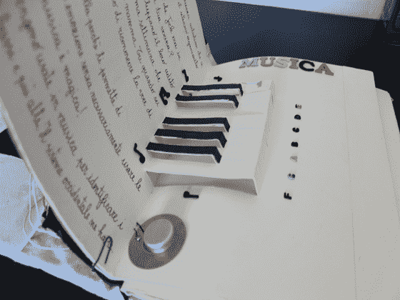

# 弹出式图书包括一个可播放的钢琴键盘

> 原文：<https://hackaday.com/2013/07/23/popup-book-includes-a-playable-piano-keyboard/>

这本书包含几个互动的电子元素。这是[安东内拉·诺尼斯]用她手头的大部分废料创作的。当然，有一些熟悉的玩家在幕后处理电子元件。

她关于构建过程的相册展示了她是如何将所有东西整合在一起的。她没有添加互动开关，而是在书页背面安装了电容式触摸传感器。一条条铜箔充当着灵活的轨迹，将连接移过绑定，并允许它们跳接至控制演出的一对 Arduino 板。没错，有两个。一个是专门运行[的弹出钢琴键盘](http://antonellanonnis.com/?/interactive/ElectronicPopUpPiano-4/)见上图。另一个在其他页面上处理艺术、数学和科学元素。

这延续了几年前我们在弹出窗口中看到的一些多媒体作品。

[https://player.vimeo.com/video/64007263](https://player.vimeo.com/video/64007263)