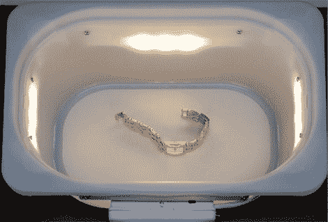

# 适合小型摄影需求的便携式灯箱

> 原文：<https://hackaday.com/2012/08/21/portable-light-box-for-small-photography-needs/>

[Paulo]需要在旅途中拍摄小物件。因为你不能总是依赖环境照明条件[他建造了一个电池供电的灯箱](http://paulorenato.com/joomla/index.php?option=com_content&view=article&id=89&Itemid=2)便于在旅途中携带。

我们以前推出过便携式轻型帐篷，但对他的口味来说，它们还是有点太大了。他选择了宜家的白色塑料储物容器。它很轻，可以作为光源的扩散器。四条灯带，每条装有三个发光二极管，安装在容器的外部。PVC 管的一半保护电路板，同时提供了一种使用螺母和螺栓将板条固定到位的方法。驱动板和电池在一个装肥皂的旅行箱里找到了家。

他喜欢这个结果，尤其是当一张光滑的白纸被用作顶部反射器时。