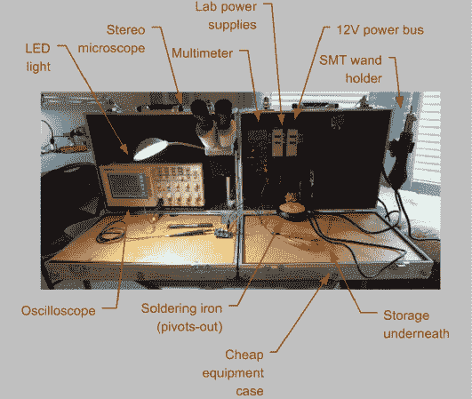

# 面向移动黑客的便携式 SMT 实验室

> 原文：<https://hackaday.com/2014/04/02/portable-smt-lab-for-hacker-on-the-go/>

我们承认，我们喜欢工作台和工具箱。[Jon]一定也有同感，因为他建造了这个[便携式表面贴装电子实验室](http://www.revely.com/blog/1nbr1)。这是一个野兽般的项目，这可能是为什么它是 Hackaday.io 上的项目[# 666](http://hackaday.io/project/666-Ultimate-Portable-SMT-Lab)。[Jon]花费大量时间在非现场工作，并不断发现自己没有合适的表面贴装焊接工具。有没有试过把 0603 电阻和 40 瓦的手枪握铁叠在一起？相信我们的话，结果并不乐观。

从港口货运公司的两个廉价铝箱开始。他给他们装上了典型的实验室用品:烙铁、示波器、万用表、两用实验室用品和各种各样的手动工具。然后，他添加了一些选择 SMT 工具:一个热风工具，一个良好的 LED 灯，和一个立体放大镜。许多工具安装在沿机箱后部的 DIN 导轨上。所有的低压设备都在一条 12V 的公共母线上运行。

我们真的很喜欢[乔恩]对箱子顶部的处理。每个盖子包含一个胶合板。当箱子打开时，胶合板就成了一个工作台面。额外的好处是，木头确实加固了原本脆弱的工具箱。我们唯一要补充的是一个好的便携式防静电垫。

最终的构建非常流畅。一旦箱子被打开，四个螺栓就成了脚。显微镜摆出来，热风枪挂在右边。插上电源，不到 1 分钟你就从零变成了 SMT 英雄。