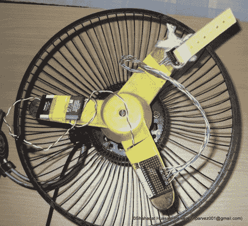

# 带有危险元素的视点显示

> 原文：<https://hackaday.com/2013/12/30/pov-display-with-an-element-of-danger/>

视觉暂留显示器总是很酷，尽管我们必须承认这个看起来很可能在高速下爆炸…

除了安全问题，[这款基于台式风扇的显示器](http://www.instructables.com/id/Rotating-display-Making-code/)为学习制作 POV 显示器提供了一个很好的起点。它利用了一个旧手机电池、一台 ATmega8、一些发光二极管、Veroboard、各种电线和焊料，当然还有一个高速台式风扇。

[shparvez001]还在他的博客上为项目提供了完整的代码，这使得复制变得非常容易。尽管我们也建议你保持它足够小，以至于原来的风扇罩仍然可以放在上面。

从美学角度来看，显示器在黑暗中看起来很好，但当灯亮着时，你可能会看到一些奇怪的外观。我们可以看到，通过将 led 安装在一个风扇叶片上，并将控制电子设备安装在另一个叶片的背面，该项目得到了极大的改善。或许还可以在风扇关闭时为电池提供无线充电？

无论如何，休息之后留下来看看实际的展示。如果你想要一个更持久的风扇视角[，尝试在天花板单元上增加显示硬件](http://hackaday.com/2009/07/22/ceiling-fan-pov/)。

[https://www.youtube.com/embed/uIR5XUyJL-Y?version=3&rel=1&showsearch=0&showinfo=1&iv_load_policy=1&fs=1&hl=en-US&autohide=2&wmode=transparent](https://www.youtube.com/embed/uIR5XUyJL-Y?version=3&rel=1&showsearch=0&showinfo=1&iv_load_policy=1&fs=1&hl=en-US&autohide=2&wmode=transparent)