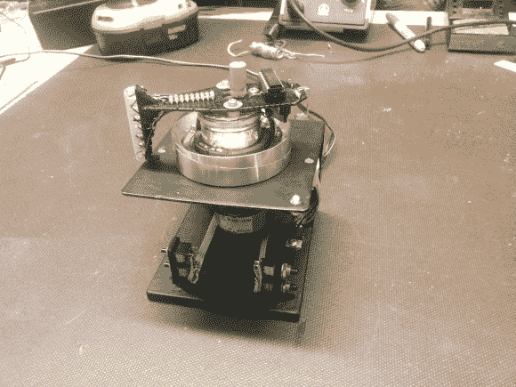

# POV Pong 游戏使用了各种智能设计

> 原文：<https://hackaday.com/2013/03/06/pov-pong-game-uses-all-kinds-of-smart-design/>

这个小设备让你[使用旋转的 LED 显示屏](http://projectlocker.ca/otherentry.php?id=1)玩一些头对头的乒乓游戏。我们真的很喜欢这个设计。通过看这张图片，你可以很好地理解视觉暂留的概念。但是在休息之后听到[丹尼斯]在视频中解释整个设计，我们真的很喜欢它的功能。

他用录像机的头作为旋转马达。显示器本身使用一排垂直的发光二极管，用一点蜡纸作为漫射体。八个像素中的每一个都受到一个 1k 电阻的电流限制。它们由 PIC 16F690 驱动，但您可能已经注意到，电路板的旋转部分没有电池。它从他自己制作的一对电刷上获得电压和接地。为了避免做同样的事情来将底座上的控制按钮映射到旋转板上，他想出了一些特别的东西。有一个面朝下的光电晶体管，它记录来自基座的 LED 信号，以上下移动桨。

如果你喜欢这个项目，请查看 POV 死星。

[https://www.youtube.com/embed/wtJ10tY7dIU?version=3&rel=1&showsearch=0&showinfo=1&iv_load_policy=1&fs=1&hl=en-US&autohide=2&wmode=transparent](https://www.youtube.com/embed/wtJ10tY7dIU?version=3&rel=1&showsearch=0&showinfo=1&iv_load_policy=1&fs=1&hl=en-US&autohide=2&wmode=transparent)