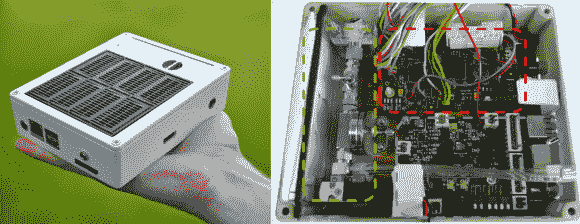

# 用氢气驱动 RPi

> 原文：<https://hackaday.com/2014/04/04/powering-a-rpi-with-hydrogen/>

寻找一种新的方式来为您的树莓派供电？拉斯伯瑞项目旨在开发一种小型燃料电池，为信用卡大小的电脑提供动力。它给 Pi 增加了一个[质子交换膜(PEM)燃料电池](http://en.wikipedia.org/wiki/Proton_exchange_membrane_fuel_cell)，一个电池和定制的控制电子设备。

该系统从压缩氢气罐中吸入氢气，并通过调节器输送。这使得氢气以正确的压力进入质子交换膜燃料电池，并产生电势。控制器电子设备将 Pi USB 端口上所需的电压提升到 5 V。还有一个电子控制的净化阀，定期排空燃料电池。

有几个原因让你想用氢来运行你的 Pi。燃料电池的运行时间只受你能储存的氢气量的限制。理论上，你可以连接一个大的钢瓶，运行很长时间。与电池结合，这对于在偏远地区运行 Pis 或长期备用电源非常有用。raspberryHy 将于本月在 2014 年汉诺威博览会上展出。