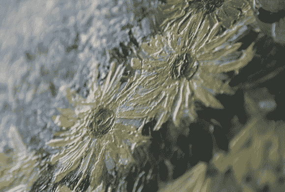

# 无价的画作——扫描和 3D 打印

> 原文：<https://hackaday.com/2013/09/24/priceless-paintings-scanned-and-printed-in-3d/>

当我们想到梵高和伦勃朗的作品时，我们大多数人都会想起一幅*画*，但我们不习惯看到真正的*画*。荷兰代尔夫特理工大学的科学家蒂姆·扎曼意识到，颜料的物质存在也传达了意义。他想创造一个逼真的全尺寸彩色复制品。虽然常见的基于激光的技术可以用于深度映射，但分辨率取决于线或点的宽度，并且相机不能用这种方法同时捕捉颜色数据。[在他的论文](http://repository.tudelft.nl/view/ir/uuid%3Abd71a192-eaa8-4f90-8778-b18f86cac79c/)中，【蒂姆】详细介绍了一种混合成像技术，包括两个摄像头和一个投影仪。他和他的团队最终使用了两台 4000 万像素的尼康相机和一台条纹投影仪，捕捉到了平面分辨率为 50 微米、深度分辨率为 9.2 μm 的地形图

除了提到 Océ(佳能公司)的高分辨率 3D 打印机之外，我们无法找到关于他们使用的打印过程的大量信息。也就是说，[蒂姆]提供了一些复制品的大量图片，我们不得不说它们看起来令人惊叹。与我们最近看到的[千兆像素扫描装置](http://hackaday.com/2013/09/01/scratch-built-gigapixel-scanner/)相比，深度信息的加入使这一技术向前迈进了一大步。

查看 BBC 对 Tim 的采访，以及休息后扫描和打印过程的延时视频。

BBC 采访:

[https://www.youtube.com/embed/er5N1Zv3oac?version=3&rel=1&showsearch=0&showinfo=1&iv_load_policy=1&fs=1&hl=en-US&autohide=2&wmode=transparent](https://www.youtube.com/embed/er5N1Zv3oac?version=3&rel=1&showsearch=0&showinfo=1&iv_load_policy=1&fs=1&hl=en-US&autohide=2&wmode=transparent)

扫描:

[https://www.youtube.com/embed/agFwb2xF6aQ?version=3&rel=1&showsearch=0&showinfo=1&iv_load_policy=1&fs=1&hl=en-US&autohide=2&wmode=transparent](https://www.youtube.com/embed/agFwb2xF6aQ?version=3&rel=1&showsearch=0&showinfo=1&iv_load_policy=1&fs=1&hl=en-US&autohide=2&wmode=transparent)

打印:

[https://www.youtube.com/embed/EXRt64HEBrk?version=3&rel=1&showsearch=0&showinfo=1&iv_load_policy=1&fs=1&hl=en-US&autohide=2&wmode=transparent](https://www.youtube.com/embed/EXRt64HEBrk?version=3&rel=1&showsearch=0&showinfo=1&iv_load_policy=1&fs=1&hl=en-US&autohide=2&wmode=transparent)