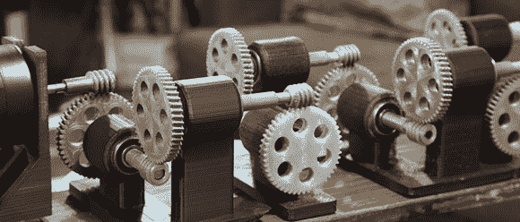

# 在宇宙热寂之前，印刷机器什么也不做

> 原文：<https://hackaday.com/2013/03/08/printed-machine-does-nothing-until-the-heat-death-of-the-universe/>

一个 2:1 的齿轮减速装置将旋转轴减速至一半速度，并使扭矩加倍。重复几次，你会得到一个可笑的扭矩量，它移动得太慢了，即使用精密仪器也看不见。这就是[Jeshua]项目背后的想法，[一台部分嵌入混凝土块中的印刷机器](http://www.thingiverse.com/thing:51248)。

[Jeshua]的建筑是[[Arthur Ganson]的一个动态雕塑](http://www.arthurganson.com/pages/Sculptures.html)的复制品。[Ganson]的机器使用 50 组齿轮将转速为 200 转/分的马达的转速降低超过 200 万亿次。雕塑中的最后一个齿轮嵌在一块混凝土中，等待着被混凝土块的侵蚀或太阳新星释放。

[Jeshua]在 PLA 中使用了 3D 打印的齿轮，而不是金属齿轮。在一个架子上组装好之后，他在最后一个几乎不动的齿轮周围浇注了混凝土。这是一个令人印象深刻的无用建筑，在最终齿轮完成 1/10 的旋转之前就会化为灰烬。如果用 ABS 而不是 PLA 打印，这台机器可能会有更长的寿命，但在我们这里谈论的时间范围内，这不会有太大的区别。