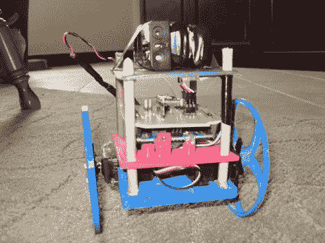

# 自动平衡器的打印和编程

> 原文：<https://hackaday.com/2012/06/25/printing-and-programming-a-self-balancer/>

Hackaday 的员工对 3d 打印机意见不一。我们中的一些人非常热情，一些人漠不关心，还有一些人想知道它们是否像宣传的那样广泛有用。但是我们认为[杰森·多维勒的]自平衡机器人是每个人都应该拥有的 3d 打印的有力证明！

不要误解我们。我们喜欢机器人项目，只是因为它是一个很酷的自我平衡器。使用带有加速度计和陀螺仪传感器的 Arduino 看着它自己站立(休息后的视频)是纯粹的胜利。但是每当我们看到这些，我们总是想到所有的机械制造。但是看看这个东西。只是[打印的零件](http://www.thingiverse.com/thing:25531)和一些木榫！这有多简单？

当然，当然，你必须有打印机，它需要很好地校准，然后你必须把设计打印出来。但是这些障碍每天都变得越来越容易克服。毕竟，并不缺少那些只想炫耀他们的 Makerbot/RepRap/etc 的朋友。

[https://www.youtube.com/embed/LAWjUlzAYf0?version=3&rel=1&showsearch=0&showinfo=1&iv_load_policy=1&fs=1&hl=en-US&autohide=2&wmode=transparent](https://www.youtube.com/embed/LAWjUlzAYf0?version=3&rel=1&showsearch=0&showinfo=1&iv_load_policy=1&fs=1&hl=en-US&autohide=2&wmode=transparent)