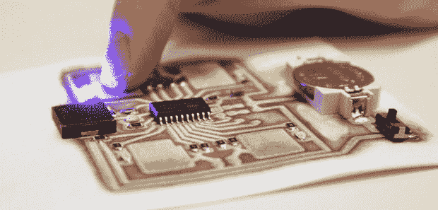

# 印刷印刷电路板

> 原文：<https://hackaday.com/2013/11/12/printing-printed-circuit-boards/>

我们真的很尊重那里的老前辈和他们制作 PCB 的惊人方法；他们在透明的醋酸纤维薄片上使用黑色胶带，通过光刻工艺制造单层 PCB。现在，制作一个 PCB 只是打开 CAD 软件包的简单事情，但像以前一样，我们仍然要处理来自中国的有害化学物质或漫长的运输时间。

前，Kickstarter 上的一个新机器人[希望改变这种情况。他们创造了一种 PCB 制造工艺，就像用喷墨打印机打印东西一样简单。只需放入一块基板——从 Kapton 到 acrylic 再到 fabric——几分钟后，你手中就有了单面 PCB。](http://www.kickstarter.com/projects/cartesianco/the-ex1-rapid-3d-printing-of-circuit-boards)

打印机分配两种化学物质，硝酸银和抗坏血酸，它们发生反应并产生电路的轨迹和焊盘。目前，EX 仅限于单面电路板，但创建多层板的实验正在进行中。

无论如何，我们对 EX 设置的简单程度印象深刻。喷墨是一种成熟的、为人熟知的技术，对于简单的自制电路来说，其分辨率已经足够，AgNO3 +维生素 C 配方可以很容易地适用于喷墨打印机的改造。