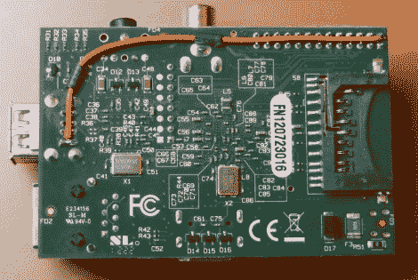

# 从 GPIO 头给 Raspberry Pi 供电时出现问题

> 原文：<https://hackaday.com/2012/09/04/problems-powering-raspberry-pi-from-gpio-header/>

[杰奥]拿了一个 ATX 电源来提供树莓派运行所需的 5V 电压。当涉及到 RPi 电源时，常见的问题是 USB 壁式适配器能够提供的电流不足。ATX 不应该有这个问题，但尽管如此，他发现 USB 端口的读数只有 5V 左右。奇怪。他抓起烙铁，[用一根跳线](http://www.digitalexperience.eu/site/hw/aggiungere-connessione-wifi-al-raspberry-pi-e-dintorni)解决了这个问题(英文翻译见他帖子的后半部分)。

该问题是在尝试让 WiFi 加密狗在 RPi 的一个 USB 端口上工作时发现的。它就是不出现，在走进假设是驱动程序问题的死胡同之后，他开始调查硬件。在发现低于标称值的电压后，[杰奥]测量了 GPIO 接头上的 5V 引脚和 USB 端口上的一个引脚之间的电阻。读数为 3-4 欧姆，他得出结论，迹线太细。我们快速浏览了一下[电路板](http://www.raspberrypi.org/archives/1090)的原理图，没有发现电压下降的原因。他的跳线解决了这个问题，但它让我们想知道，这是一个孤立的情况，还是一个设计缺陷？在评论区告诉我们你的想法。