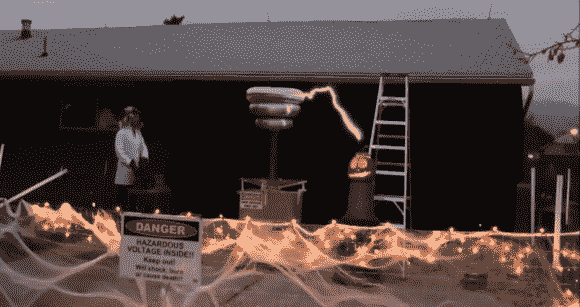

# “基尔·伏特教授”用他的特斯拉线圈电击南瓜

> 原文：<https://hackaday.com/2013/11/03/professor-kill-a-volt-shocks-pumpkins-with-his-tesla-coil/>

[JJ·达什尔]今年又回来了，[震撼一些南瓜！](http://www.youtube.com/watch?v=tT8eUIq-LB0)(音量警告)。两年前，我们特别报道了 JJ 和 T2 的万圣节糖果震惊特斯拉线圈。他显然一直在他的疯狂科学家实验室忙着做一些升级。今年他的线圈产生了 5 英尺长的流动电弧！

[JJ 的]特斯拉线圈是一个使用两个微波炉变压器作为电源。他还使用了异步旋转火花隙(ASRG)。顾名思义，旋转火花隙使用电机来转动转子。在旋转的某些点上，转子产生一个足够小的间隙，高压火花可以跳过，激励初级线圈。这个想法类似于汽车点火系统分电器。[Pete]在这段视频中举了一个很好的 ASRG 的例子。大多数 ASRG 的特斯拉线圈使用小马达来旋转火花隙。改变电机的速度会产生典型的“电机加速”噪音，这种噪音在特斯拉线圈的最后一段电弧中可以听到。

[JJ]在线圈附近的南瓜里安装了几个荧光灯泡，让事情变得更有趣了。线圈很容易点亮它们，当南瓜被敲击时，它们会发出更亮的光。仍然不满意，他还戴上了他的接地锁子甲手套，自己画出了弧线。我们总是喜欢看到人们安全地被巨大的特斯拉线圈击中，但这绝对属于“不要在家里尝试这个”的范畴。

[https://www.youtube.com/embed/tT8eUIq-LB0?version=3&rel=1&showsearch=0&showinfo=1&iv_load_policy=1&fs=1&hl=en-US&autohide=2&wmode=transparent](https://www.youtube.com/embed/tT8eUIq-LB0?version=3&rel=1&showsearch=0&showinfo=1&iv_load_policy=1&fs=1&hl=en-US&autohide=2&wmode=transparent)