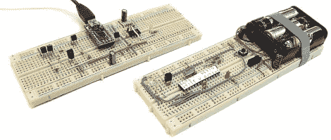

# 使用 Arduino IDE 通过 IR 对 Arduino 进行编程

> 原文：<https://hackaday.com/2012/05/07/program-your-arduino-via-ir-using-the-arduino-ide/>

这里有一种方法可以在使用现有 IDE 的同时对 Arduino 进行无线编程。它使用一种叫做 SuperDuplex 的替代引导程序，以及一个类似电视遥控器的红外接收器。

如您所见，这需要两个部分。目标设备具有红外接收器，以及通过 USB 连接到计算机的发送单元。休息之后你可以看到编程过程的演示。这可能有点慢，但没有什么离谱的。

对于业余爱好电子产品，我们总是想“它是做什么的？/是为了什么？”是错误的问题。但在这种情况下，我们有一个非常明显的用途。如果你已经建造了一个在恶劣环境中使用的小工具，并希望将外壳中的开口数量保持在最低限度(就像水下机器人一样)，这是完美的。只要确保有一个红外接收器的窗口，你就可以随心所欲地编程了。当然，看起来你仍然需要一种方法来手动重置目标芯片，但你会想到一些东西。

[https://www.youtube.com/embed/hhBlUWy1W_8?version=3&rel=1&showsearch=0&showinfo=1&iv_load_policy=1&fs=1&hl=en-US&autohide=2&wmode=transparent](https://www.youtube.com/embed/hhBlUWy1W_8?version=3&rel=1&showsearch=0&showinfo=1&iv_load_policy=1&fs=1&hl=en-US&autohide=2&wmode=transparent)