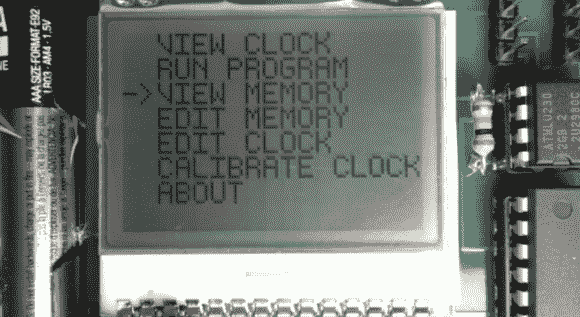

# 由简陋的小房子建成的可编程计算机 84

> 原文：<https://hackaday.com/2013/03/05/programmable-computer-built-from-a-humble-attiny84/>

这里有一种方法可以玩简单的计算概念，而不会对硬件方面的东西太着迷。[约翰·艾森曼]称之为小双人组。它是一台基于 ATtiny84 的可编程计算机。他自己编写了操作系统，内置了一组命令，使其功能强大，但允许用户使用四按钮界面操纵甚至编写程序。在休息之后的剪辑中演示了编辑和运行程序(包括一些游戏)。

该系统中使用的三个主要组件是 ATtiny84 和容量为 64 KB 的 EEPROM 芯片，以及上面看到的 102×64 像素 LCD 屏幕。这个项目开始于一个试验板，但是当他把每一个部分都变成现实时，它就变成了一个条形板原型，最后变成了这个 fab-house 版本。

[https://www.youtube.com/embed/iSDpw5Y824w?version=3&rel=1&showsearch=0&showinfo=1&iv_load_policy=1&fs=1&hl=en-US&autohide=2&wmode=transparent](https://www.youtube.com/embed/iSDpw5Y824w?version=3&rel=1&showsearch=0&showinfo=1&iv_load_policy=1&fs=1&hl=en-US&autohide=2&wmode=transparent)