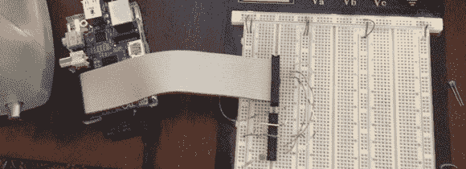

# 用 Raspi 编程微控制器

> 原文：<https://hackaday.com/2013/05/29/programming-microcontrollers-with-a-raspi/>

Arduino 的出现将微控制器的世界带给了全世界的爱好者、学生和艺术家。现在，我们正处于业余爱好者电子产品的新一轮扩张中，但我们不能指望每个人都永远呆在舒适、复杂、耗电的 Linux 世界中，不是吗？最终，所有这些修补程序都将想要编写一个微控制器，如果他们已经有了一个树莓派，为什么不使用它呢？

[Kevin]想把他的 Raspi 变成一个 AVR 开发工作站，而不使用任何外部程序员。他决定使用 Raspi 的 spi 端口与 AVR 微控制器进行通信，并能够通过几根电线和几个电阻进行电气连接。

对于软件，[Kevin]在 avrdude 中增加了对 SPI 的支持，可以在他的 git 上获得。从理论上讲，这应该适用于任何 AVR 微控制器，以及我们已经爱上的最流行的 ATMegas 和 ATtinys。它不支持使用 TPI 编程的非常奇怪的芯片，但它仍然非常有用。