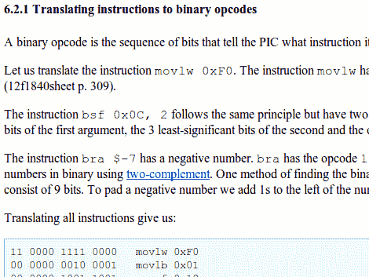

# 没有工具链的编程；手工制作 PIC 操作码

> 原文：<https://hackaday.com/2012/09/18/programming-without-a-toolchain-crafting-pic-op-code-by-hand/>

我们一直过着奢侈的生活，在文本编辑器中编写我们的微控制器代码，并使用编译器将其转化为芯片可以使用的东西。[丹·阿姆隆德·汤姆森]向我们展示了一种不同的做事方式。他实际上正在手工为 PIC 微控制器制作操作代码。我们很高兴他深入地解释了这一点，因为现在我们觉得力不从心。

他的程序非常简单，它闪烁一个 LED，他选择用 PIC 12F1840 工作。第一步是使用数据手册中的 14 位二进制值发布配置芯片的字。从那以后，他继续用汇编代码编写程序。在这一点上，他几乎可以通过汇编程序运行它，但他现在才真正开始。他介绍了封装配置字所需的格式，然后继续说明了汇编命令到二进制操作码的翻译。我们不确定我们是否会亲自尝试一下，但是阅读它确实很有趣。