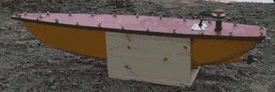

# 项目海洋渲染自动渲染海底

> 原文：<https://hackaday.com/2015/05/25/project-sea-rendering-autonomously-renders-sea-bottoms/>

[Geir]创造了一个非常漂亮的设备，这实际上是他的第二个版本的自主船，用于绘制湖泊和池塘的深度。他称之为[海洋渲染](http://letsmakerobots.com/node/21098)。这个项目非常严肃，因为船体是由玻璃纤维制成的。推进装置是一个简单的 DC 马达，方向舵由遥控伺服系统驱动。一盏灯和一面旗帜装饰着顶层甲板，使得其他可能经过的大船可以看到这艘小船。七节电池负责所有的电力需求。

飞行器的航线在任务规划器中预编程，并使用 Arduino 上装载的 ArduPilot 来驾驶到规定的航路点。船上的 GPS 模块确定船只的位置，而传感器测量水深。位置和深度值都保存在 SD 卡中。这些数值随后可以输入到一个名为 Dr Depth 的软件中，该软件可以生成被水覆盖的地面的地形图。

[Geir]已经让这个坏小子踏上了 18 公里的旅程，经过了 337 个地点。真是令人印象深刻！他估计，在最高速度为 3 公里/小时的情况下，预计运行时间为 24 小时，这意味着它可能在一次充电后行驶 72 公里，同时在航行中进行 700 次深度测量。

[https://www.youtube.com/embed/TVOhI6sVFAo?version=3&rel=1&showsearch=0&showinfo=1&iv_load_policy=1&fs=1&hl=en-US&autohide=2&wmode=transparent](https://www.youtube.com/embed/TVOhI6sVFAo?version=3&rel=1&showsearch=0&showinfo=1&iv_load_policy=1&fs=1&hl=en-US&autohide=2&wmode=transparent)