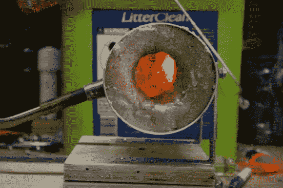

# 由汤罐制成的丙烷熔炉

> 原文：<https://hackaday.com/2013/07/28/propane-forge-built-from-a-soup-can/>

它看起来不怎么样，但是这个[容易建造的丙烷熔炉](http://imgur.com/a/tMo8n)正是你在锻造中需要尝试的。【代码牛仔】在[看完这个视频](http://www.youtube.com/watch?v=jBVa2bw3r_k)后接手了这个制作，视频展示了完成锻造制作后一把小刀的制作。

第一步是吃完所有的汤(或者豆子，如果你喜欢的话)。手里拿着一个空罐，支架(由两个角撑架组成)和入口已连接。接下来是铁匠铺墙壁的隔热层。乍一看，我们以为猫砂是原料之一，但那只是一个用来装运操场沙子的空容器。在加水之前，将沙子与等量的熟石膏混合，以达到粘土般的稠度。这是装在罐子里，有一个小开口来接受金属加热。

火炬本身可以用来固化隔热罩。让混合物变硬后，燃烧 30 分钟会迫使剩余的水离开隔热层。

[https://www.youtube.com/embed/jBVa2bw3r_k?version=3&rel=1&showsearch=0&showinfo=1&iv_load_policy=1&fs=1&hl=en-US&autohide=2&wmode=transparent](https://www.youtube.com/embed/jBVa2bw3r_k?version=3&rel=1&showsearch=0&showinfo=1&iv_load_policy=1&fs=1&hl=en-US&autohide=2&wmode=transparent)

[via [Reddit](http://www.reddit.com/r/Blacksmith/comments/1j0fon/i_built_the_soup_can_forge_today_in_a_hour/)