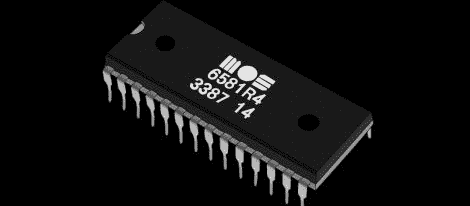

# 螺旋桨变成了带有软件 SID 的 Chiptune 播放器

> 原文：<https://hackaday.com/2012/08/31/propeller-turned-into-chiptune-player-with-a-software-sid/>

如果没有足够的理由喜欢视差推进器，现在你可以用自己的[袖珍 SID 音频播放器](http://www.instructables.com/id/Build-your-own-Pocket-SID-Audio-Player/?ALLSTEPS)听 chiptunes。

这款 chiptune 音频播放器使用了非常不寻常、非常酷的八核 Parallax Propeller 微控制器。在将一些电容和电阻焊接到 Propeller dev 板上以允许音频输出后，播放 SID 音乐文件唯一需要的就是一点代码和一个 SD 卡插座。

这个版本的关键代码是由[Johannes Ahlebrand]编写的 [SIDcog 对象](http://obex.parallax.com/objects/734/)这段代码将 Propeller 中的八个核心之一变成了经典的 Commodore 64 声音芯片的虚拟版本。

由于 SIDcog 对象只占用八核 Propeller 上的一个核，因此有可能将这个 SID 播放器变成一个全包的 chiptune 音频源；Atari POKEY 或 FM 合成齿轮的加入将允许几乎任何可以想象的 chiptune 声音在口袋中携带。

没有音频演示，任何关于 chiptunes 或 SID 的 Hackaday 帖子都是不完整的，因此您可以在休息后查看螺旋桨驱动的 SID。

[https://www.youtube.com/embed/Nj5BEQ4bup4?version=3&rel=1&showsearch=0&showinfo=1&iv_load_policy=1&fs=1&hl=en-US&autohide=2&wmode=transparent](https://www.youtube.com/embed/Nj5BEQ4bup4?version=3&rel=1&showsearch=0&showinfo=1&iv_load_policy=1&fs=1&hl=en-US&autohide=2&wmode=transparent)