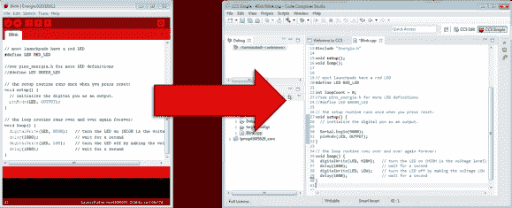

# Energia 草图的正确调试

> 原文：<https://hackaday.com/2014/07/13/proper-debugging-for-energia-sketches/>

Energia 是一款将 Arduino 和布线框架引入德州仪器 MSP430 微控制器和 MSP430 Launchpad 开发板的工具。这允许在类似 Arduino 的环境中轻松开发，同时针对不同的微控制器系列。

Energia 和 Arduino 的一个问题是调试困难。通常，我们会将一个 serial . println()；并监视串行端口以跟踪我们的程序正在做什么。其他选项包括闪烁的 led，或使用外部显示器。

TI 的官方开发工具 Code Composer Studio 允许对应用程序进行逐行调试。您可以设置断点，观察变量值，一次一条指令地单步执行应用程序。

好消息是最新版本的 Code Composer Studio 支持导入 [Energia 草图](http://43oh.com/2014/07/import-energia-sketches-into-ccs6-for-line-by-line-debugging/)。一旦导入，您就可以单步执行代码并轻松调试您的应用程序。这对于使用 Energia 开发更复杂软件(如库)的人来说是一个巨大的帮助。

休息之后，TI 在一段视频中向我们概述了新功能。

【感谢 Adrian 的提示！]

[https://www.youtube.com/embed/T4CQzE8ae7M?version=3&rel=1&showsearch=0&showinfo=1&iv_load_policy=1&fs=1&hl=en-US&autohide=2&wmode=transparent](https://www.youtube.com/embed/T4CQzE8ae7M?version=3&rel=1&showsearch=0&showinfo=1&iv_load_policy=1&fs=1&hl=en-US&autohide=2&wmode=transparent)