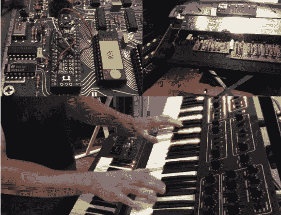

# 先知 600:经典合成器获得处理器升级

> 原文：<https://hackaday.com/2014/03/18/prophet-600-a-classic-synthesizer-gets-processor-upgrade/>

我们喜欢 Hackaday 的经典合成器。[gligli]也是，但他不喜欢 Prophet 600 的处理器限制。这就是为什么他以 Teensy ++ T1 的形式给了它一个新的大脑。[时序电路先知 600](http://www.vintagesynth.com/sci/p600.php) 在 1982/1983 年发布时是一件大事。600 是第一款包含 [MIDI](http://hackaday.com/2014/03/08/the-tannin-diy-midi-controller/) 接口的商用合成器。600 的原始设计可以被称为混合动力车。Zilog Z80 微处理器控制的模块化模拟语音芯片。不过，Z80 在这种配置下有点紧张，一些限制也很明显。8 位处理器对于软件驱动的包络和低频振荡器(LFO)控制来说是不够的。一切都是通过 14 位 DAC 驱动的，这进一步加剧了这种情况。

[gligli]发现 600 的大部分限制都是由处理器造成的。通过增强处理能力，他可以真正释放 600 以内的潜力。由于他实际上没有先知 600，他从原理图开始。[gligli]创建了一个基于 PC 的数字电路仿真器，在工作中学习整个系统。这个阶段完成后，[gligli]买了一个二手的 Prophet 并开始黑客活动。Teensy++需要一些硬件模块来填充 Z80 的鞋子，包括切断一个引脚和添加一些跳线。我们真的很喜欢先知 600 本身不需要任何改变的事实。拿出 Teensy++,放入 Z80，你就可以像 1982 年一样尽情狂欢了。

新处理器直接与 Z80 的 8 位总线接口。由于 Teensy 上的 AVR 内置了 RAM 和 ROM，所以它只是忽略了原系统的 ROM 和 RAM 地址空间。不过，将快速微处理器与 8253 定时器和 68B50 UART 等较老的器件进行接口确实有其缺陷。系统总线必须运行得足够慢，才能不违反各种外围芯片的时序要求。为了解决这个问题，[gligli]在他的固件中增加了一些等待语句。一旦系统开始工作，[gligli]就可以自由地开始添加新功能。他首先平滑步进包络和滤波器发生器，并添加新的指数模式。从那里，他添加了新的键盘复调模式，以及音高和调制轮的变化。完整系列的新功能在[说明手册](http://sfx.gligli.free.fr/zik/p600/Prophet600FirmwareUpgrade_en_beta_1_0.pdf) (PDF 链接)中列出。由于这是一个开源项目，添加一个特性就像打开您最喜欢的编辑器并编写它一样简单。

[https://www.youtube.com/embed/TZPoo89o69U?version=3&rel=1&showsearch=0&showinfo=1&iv_load_policy=1&fs=1&hl=en-US&autohide=2&wmode=transparent](https://www.youtube.com/embed/TZPoo89o69U?version=3&rel=1&showsearch=0&showinfo=1&iv_load_policy=1&fs=1&hl=en-US&autohide=2&wmode=transparent)

[感谢之吻]