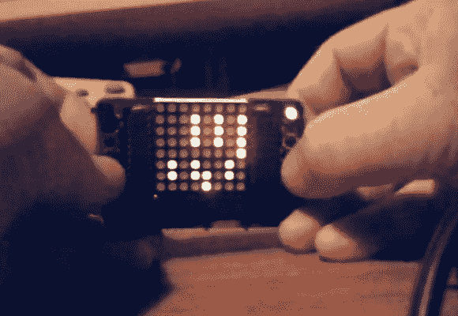

# 低分辨率手持游戏装备原型

> 原文：<https://hackaday.com/2013/01/10/prototyping-a-low-resolution-handheld-gaming-rig/>

[Jason]一直在努力开发这款基于 Arduino 的低分辨率游戏平台。他甚至让一个 fab house 送来电路板，把所有东西组装在一起。在他手里有点小，图形也仅限于显示器提供的 8×8 像素。但它看起来仍然很有趣，而且代码的编写使得添加新游戏变得非常容易。

该板承载一个 ATmega328，它使用一对 TPIC6B595 移位寄存器驱动双色 LED 显示器。控件由显示屏两侧的按钮集合提供。该装置由焊接在 PCB 背面的三节 AAA 电池供电。

上图显示[Jason]正在尝试一款太空入侵者游戏。休息后的剪辑显示了可敬的行动，从压电蜂鸣器的声音，它甚至在游戏结束时滚动你的分数。但你不仅限于一个头衔。添加新游戏就像在新的头文件中实现一个类一样简单。你可以通过查看[源代码报告](https://github.com/hotchk155/AVRGame)来感受一下这是如何设置的。

这让我们想起了[Pixel Bros 低分辨率系统](http://hackaday.com/2011/09/12/super-pixel-bros-now-with-manufactured-pcb-and-rewritten-software/)。

[https://www.youtube.com/embed/38tsHgjtxk0?version=3&rel=1&showsearch=0&showinfo=1&iv_load_policy=1&fs=1&hl=en-US&autohide=2&wmode=transparent](https://www.youtube.com/embed/38tsHgjtxk0?version=3&rel=1&showsearch=0&showinfo=1&iv_load_policy=1&fs=1&hl=en-US&autohide=2&wmode=transparent)