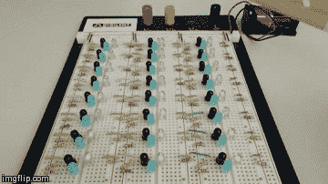

# 接近感应 led 可以为您的项目增添新的活力

> 原文：<https://hackaday.com/2014/08/30/proximity-sensing-leds-can-add-a-new-dynamic-to-your-projects/>

正在寻找一种有趣又简单的方法来为你的 LED 项目增加更多的互动吗？为什么不把它们变成[接近感应发光二极管呢？](http://www.instructables.com/id/Motion-Sensing-LEDs)

我们的黑客，威尔，刚刚开始设计他自己的印刷电路板。他正在寻找一个简单的项目来尝试，设计和制造 PCB 不会太难，所以他想出了这个聪明的互动 LED 阵列。

它实际上是一个非常简单的电路，这也使得它非常容易在原型试验板上构建。每个近程传感 LED 由五个部件组成。三个电阻、一个发光二极管、一个红外发光二极管和一个光电晶体管。红外 LED 是根据所用光电晶体管的类型专门选择的，在这种情况下，它发射 880 纳米的波长，这是光电晶体管可以识别的光类型。

这些组件以红外发光二极管一直亮着的方式连接。普通的 LED 与光电晶体管串联，因此只有当光电晶体管看到你在它上面挥动的任何物体反射回来的 880 纳米光时，LED 才会打开。

真正酷的是，如果你在组合中添加 555 个定时器，并在 led 消失之前有一个延迟——那么你就可以拥有一个巨大的阵列，在你触发传感器后很久还会留下运动轨迹！

[via [危险原型](http://dangerousprototypes.com/2014/08/25/proximity-sensing-leds/)