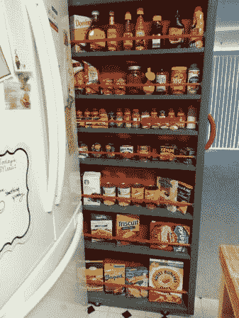

# 拉出式餐具室占据了冰箱旁边的空间

> 原文：<https://hackaday.com/2013/07/06/pull-out-pantry-fills-space-next-to-refrigerator/>

你的冰箱需要在铰链一侧留出几英寸的空间，以便让门完全打开。如果在那一边有一堵墙，这意味着你留下了一个缺口。一点木材和一些便宜的小五金可以把这个缺口变成一个可拉出的储藏室。

这张图片来自[rat max 00]pantry 项目。他有一个 6.5 英寸的工作间隙，并通过使用平头螺丝制作一个木制框架来开始建造。底部增加了四个脚轮，使它可以轻松地滚入和滚出。他需要一个把手和一种方法来确保商品不会从货架上掉下来。他选择使用 3D 打印机来制作支撑栅栏销钉和定制手柄的支架。如果你没有，就去当地家居商店的橱柜五金件通道看看。

我们想知道，除了几个轮子之外，是否有可能在橱柜的上方和下方安装完全伸展的拉杆？这将有助于防止餐具室刮擦冰箱或墙壁。

当你在做书架大小的东西时，为什么不也做一个隐藏的门呢？