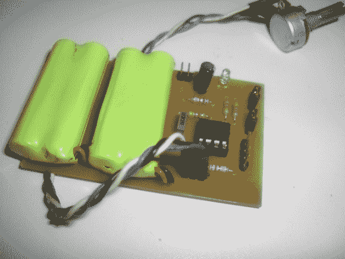

# 脉冲发生器告诉你的电机“获取 Ta 步进”

> 原文：<https://hackaday.com/2014/07/14/pulse-generator-tells-your-motors-get-ta-steppin/>

步进电机对很多项目来说都很棒；例如数控机床、时钟或机器人。有时候，在做一个包含步进电机和驱动器的项目时，最好不要把所有东西都连接起来，而是测试一下构建的这一部分。脉冲发生器可以用来完成这样的任务，[CuteMinds]已经组装了一个专门为步进电机定制的 [DIY 友好版本](http://www.cuteminds.com/index.php/pulsegenerator)。这个设备使测试这些步进电机的工作变得快速而简单。

脉冲发生器的核心是一个 12F675 微芯片，它依靠电位计的电阻值将方波阶跃信号输出从 20hz 调整到 3khz。只有步骤信号会很酷，但这个项目走得有点远。板上有 3 组接头，允许您连接跳线或开关，以便:1)打开电源，2)启用步进驱动器，3)选择电机转动的方向。板载电池使该装置便于远程使用。

如果你渴望自己制作一个，可以从上面的链接下载 [Eagle](http://www.cadsoftusa.com/eagle-pcb-design-software/product-overview/?language=en) 原理图和电路板文件。