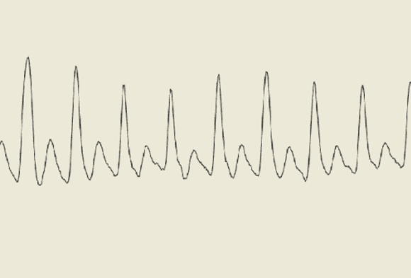

# 脉搏血氧仪在电脑上显示血氧水平

> 原文：<https://hackaday.com/2012/11/27/pulse-oximeter-displays-blood-oxygen-levels-on-a-pc/>

上一次你在一次涉及 PVC 压力容器的可怕事故后被送进急诊室时，一名护士可能把一个叫做脉搏血氧仪的装置夹在你剩下的一个手指上。这些小型电子设备通过一对发光二极管和一个光电传感器来检测你的脉搏和血氧水平。[Anders]发来了一篇很棒的教程，介绍如何使用别致的 ARM 开发板[构建自己的脉搏血氧仪](http://blog.energymicro.com/2012/11/21/create-a-simple-pulse-oximeter-with-tiny-gecko/)，但这款设备背后的工作原理可以转移到几乎任何微控制器平台。

脉搏血氧仪背后的理论基于这样一个事实，即血红蛋白根据其氧合水平不同而吸收红光和红外光。通过手指将红色和红外 LED 照射到光敏电阻上，只需一点点数学运算就可以确定一个人的血氧水平。

当然，需要在项目中投入一点硬件；为此，[Anders]使用了一个 [EMF32 Gecko 入门套件](http://www.energymicro.com/tools/efm32-tiny-gecko-starter-kit)，一个看起来很棒的 ARM 开发板。在将 led 连接到几个晶体管和运算放大器后，[Anders]将他的传感器电路连接到 Gecko 板上的 ADC。从这里很容易计算他的血氧水平，甚至显示他的脉搏率到电脑应用程序。

是的，只需一个开发板和几个 led 的价格，就有可能以远低于商用 pulseox 测量仪的价格构建您自己的医疗设备。不包括 FDA 批准。