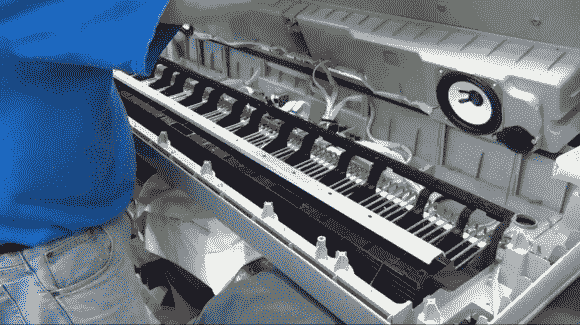

# 把耳机插孔放在你想放的任何地方

> 原文：<https://hackaday.com/2012/12/25/put-that-headphone-jack-anywhere-you-want-it/>

看看这个全新的雅马哈键盘。事实上，我们看到的胆量意味着[托德哈里森]可以吻别他的保修。但现在你应该知道，当他的电子产品出问题时，他不会去找别人。这一次，他没有修理任何东西。他不喜欢在键盘后面插上耳机。他把它打开，[把耳机插孔移到一个更方便的位置](http://www.toddfun.com/2012/12/22/yamaha-dgx-640c-phono-jack-hack-and-easel-upgrade/)。

正如你所看到的，里面有一吨的空间，一旦中密度纤维板基地举行的扬声器和一些共鸣箱被删除。当他在里面的时候，他仔细观察了钥匙的结构。它们用金属棒加重(见上图),让演奏者感觉电子乐器更像是原声版。但是他也没有忽视呆呆看着所有电子设备的机会。

拔出带有耳机插孔的 PCB 后，他开始用一个焊钳工作。随着焊料的消失，他切断了将插孔固定在电路板上的胶水。剩下的就是在它的位置焊接一些电线，给它一个漂亮的项目箱作为外壳。为了完成破解，他将盒子安装在 MDF 底座上，现在耳机连接在前面。休息后在视频中看到整个过程。

[https://www.youtube.com/embed/GVxjvgwX6uc?version=3&rel=1&showsearch=0&showinfo=1&iv_load_policy=1&fs=1&hl=en-US&autohide=2&wmode=transparent](https://www.youtube.com/embed/GVxjvgwX6uc?version=3&rel=1&showsearch=0&showinfo=1&iv_load_policy=1&fs=1&hl=en-US&autohide=2&wmode=transparent)