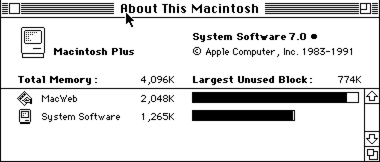

# 将 Mac Plus 放到互联网上

> 原文：<https://hackaday.com/2013/12/13/putting-a-mac-plus-on-the-internet/>

[Jeff]有一台 Mac Plus，一台 8 MHz 的计算机，内存为 4 MB，屏幕为 512×342 1 位。这是他的第一台“真正的”电脑，就像那些周日开着 A 型福特出去兜风的人一样，[【杰夫】决定把这台旧电脑放到互联网上。](http://www.keacher.com/1216/how-i-introduced-a-27-year-old-computer-to-the-web/)

A Plus 有几个上网的选择。最好的，但也是最贵的，是 SCSI 转以太网计算机。对于速度稍慢的连接，PowerPC mac 可以用作以太网到 local talk(Macintosh 串行端口网络协议)的网桥。缺少这些硬件中的任何一个，[Jeff]决定使用树莓 Pi。Pi 完成了繁重的工作，一些串行适配器和电压转换器将 Pi 转换成可以与 Plus 串行端口通信的东西。

即使有了 MacTCP 栈和 MacWeb 浏览器，仍然有一些事情是这台古老的计算机无法做到的。HTTPS 直到 1994 年才被发明出来，cookies 只是一种痛苦，而 CSS 是正确的。这意味着现代网站(当然，除了 [Hackaday 复古版](http://retro.hackaday.com/))根本无法正常呈现。为了解决这个问题，[Jeff]的朋友[Tyler]想出了一个 Python 脚本，使用请求、漂亮的汤和 Flask 来去除所有 Web 2.0 cruft，处理 cookies，并摆脱 SSL。

最终的结果是，一台 Mac Plus 拥有 4 兆内存，可以上网浏览维基百科和黑客新闻。它的速度无论如何都不算快——在下面的视频中，打开《黑客新闻》的头版大约需要五分钟——但它*是互联网上一台 27 岁的电脑*。

[https://www.youtube.com/embed/5UBRUyofiiU?version=3&rel=1&showsearch=0&showinfo=1&iv_load_policy=1&fs=1&hl=en-US&autohide=2&wmode=transparent](https://www.youtube.com/embed/5UBRUyofiiU?version=3&rel=1&showsearch=0&showinfo=1&iv_load_policy=1&fs=1&hl=en-US&autohide=2&wmode=transparent)