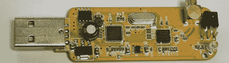

# 在 Mac 上安装软件无线电

> 原文：<https://hackaday.com/2012/05/12/putting-a-software-defined-radio-on-a-mac/>

几个月前[Antti Palosaari]发现廉价的 USB 电视调谐器可以用作软件定义的收音机。从那以后，我们看到这些电视调谐器接收来自 GPS 卫星的信号，甚至空中交通管制和客机之间的信号。像所有很酷的东西一样，Mac 对这些驱动程序的支持有点糟糕，所以[hpux735] [编写了自己的 Cocoa 应用程序](http://www.alternet.us.com/?p=1652)来支持这些令人惊叹的加密狗。

[hpux735]的驱动程序是 [osmocom 驱动程序](http://sdr.osmocom.org/trac/wiki/rtl-sdr)的一个端口，被重新打包成一个原生的 Cocoa 应用程序，因此不需要非常易变的 libusb 和其他依赖项。所有代码都在 [GitHub](https://github.com/hpux735/Softshell) 上，准备好让你开始玩 SDR。

至于那些涉足软件定义无线电深水领域的人的教程，上个月出现了许多操作指南，以快速启动和运行 SDR noobs。以下是我们见过的几个最好的例子:

[braingram]为 Ubuntu 用户发布了一个指令。

对于那些在[balint]周围放着 Windows box 的人，贴上一张[入门指南](http://www.rtlsdr.com/2012/04/getting-started-with-rtl-sdr-dongle/)。

这里有一个稍微更全面的 Windows 指南。

电视调谐器 SDR 社区中的大部分开发都发生在 [RTLSDR subreddit](http://www.reddit.com/r/RTLSDR/) 上，那里有足够多的信息来处理这些电视调谐器加密狗的任何事情。如果你想出这种狗的一种新用途，请在提示行发送给[。](http://hackaday.com/contact-hack-a-day/)