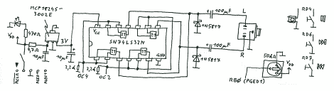

# 把一个雅达利口袋放在你的口袋里

> 原文：<https://hackaday.com/2012/06/15/putting-an-atari-pokey-in-your-pocket/>

Atari POKEY 是古老的 Atari 400/800 和 XL/XE 8 位计算机的主要 I/O 芯片。虽然设计用于从游戏手柄获取电压并扫描键盘开关矩阵的芯片在 30 年后通常不会被记住，但 POKEY 还有另一个功能:为那些老款雅达利游戏生成非常非常独特的音乐和声音效果。[Markus Gritsch]想要一个便携式版本的 POKEY，所以他[在现代微控制器](http://dangerousprototypes.com/forum/viewtopic.php?f=56&t=3944)上模拟了一个。现在，无论他去哪里，他都可以带着那些古老的雅达利芯片音乐。

该版本使用了另一款 Atari 播放器,模拟了基于 PIC32MX 的微控制器中的 6502 和 POKEY 芯片。没有太多的物理硬件[Markus]需要处理——该板是基于 QFP 原型板[Markus]构建的，增加了几个按钮和一个插孔，用于一些简单的 I/O

这并不是[Markus]第一次尝试将 chiptunes 便携式化——去年，我们看到了一款真正令人敬畏的便携式 SID 播放器,它使用了相同的 PIC32 微控制器和仿真的 6502。在[雅达利 SAP 音乐档案库](http://asma.atari.org/)和[高压 SID 收藏库](http://www.hvsc.c64.org/)之间，【马库斯】有足够多的 chiptunes 来享受几天的听觉享受。