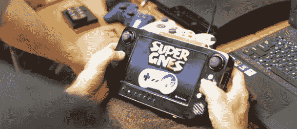

# 将每一台游戏机放在你的手掌中

> 原文：<https://hackaday.com/2013/09/06/putting-every-game-console-in-the-palm-of-your-hand/>

casemodders extra ordinaire[Downing]和[Hailrazer]以其出色的构建而闻名，几乎可以将所有游戏主机都放入便携式手持设备中。从 Game Cube 到 N64s 和 Sega Genesis 的一切都被这两个公司征服了，在过去的一年里，他们一直在集思广益，以制定永远便携式主机游戏的最佳解决方案。它被称为交叉平面(Cross Plane),将几乎所有带有 HDMI 连接的东西放在你的手掌中。

这座建筑是作为[唐宁]更雄心勃勃的项目之一开始的。他设想了一个可以在小型手持设备上玩几乎所有复古游戏的系统。完成这个构建后，他建立了一个 Kickstarter，并打电话给他的朋友[Hailrazer]以获得一些反馈。就在 Kickstarter 发布前几个小时，[Hailrazer]建议为现代游戏机制作一款设备。[唐宁]的骄傲和喜悦被摧毁了，但是十字飞机从它的灰烬中升起。

十字板内部是一个无线 HDMI 接收器和一个 7”720 p 显示器。这一点，加上一些按钮和模拟控制，允许 Cross Plane 作为 XBox 360，Playstation 3，甚至 PC 的远程显示器和控制器，以实现所有复古仿真器的优点。

这是一个非常非常酷的项目，自从[一个开放式 Wii U 控制器](http://hackaday.com/2012/11/17/wii-u-to-be-released-this-weekend-wii-u-gamepad-to-be-torn-apart-on-workbenches-across-the-land/)的梦想似乎已经破灭，我们认为这可能是一个用于 FPV 四轴飞行器或其他遥控车辆的伟大控制器。