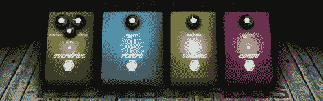

# 将吉他踏板放在网页中

> 原文：<https://hackaday.com/2012/10/10/putting-guitar-pedals-in-a-web-page/>

根据我几个音乐家朋友的说法，弹吉他只有一半时间是在指板上上下移动手指，敲打一些和弦。另一半是掌握你的音调的艺术，通常通过放大器设置和踏脚转盘。

效果踏板是吉他和放大器之间的小电子盒，能够放大和扭曲吉他的输出，添加混响和延迟，甚至通过 wha 或包络踏板过滤音调。这些踏板可以在软件中模拟，但我们无法相信它们现在可以在 JavaScript 中完全被[模拟。](http://dashersw.github.com/pedalboard.js/)

Pedalboard.js 是由[dashersw]开发的一个项目，旨在将一系列踏板放到“云端”,让编辑和效果板变得像创建网页一样简单。

该项目是围绕 Webkit 的 W3C 音频 API 构建的，允许这个虚拟踏板在 Chrome、Safari 和其他支持 Webkit 的浏览器中工作。踏板被编程为节点，每个节点可配置为具有输入、输出或分析器，能够修改电脑上线路接收的任何内容的增益、波形或滤波器。

这是 Pedalboard.js [的一个小演示，这里有一个预先录制的吉他轨道，输入到几个踏脚转盘中。如果你想玩一些吉他效果，这是一个非常酷的想法，但我们迫不及待地想看到由](http://dashersw.github.com/pedalboard.js/demo/)[效果踏板制造商](http://ehx.com/)实现的 JavaScript 允许我们在购买前尝试。