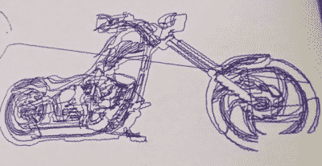

# PVC CNC 机器制造带来了很好的学习体验

> 原文：<https://hackaday.com/2015/05/27/pvc-cnc-machine-build-results-in-a-great-learning-experience/>

业余爱好级别的数控机床使用起来很有趣，是制作项目的好工具。那么一个数控新手如何入门呢？我们的意见是，最好立即开始行动。[WTH]想了解更多关于数控机床的知识，并决定用他家里到处扔的零件[建造自己的](http://whiskeytangohotel.com/cnc)。

正如你所看到的，框架是由 PVC 管制成的。此外，线性轨道也是聚氯乙烯和线性轴承…..更大直径的 PVC。扫气步进电机和螺纹杆负责移动 X 和 Y 轴。电子方面，一个 Arduino Uno running [GRBL](https://github.com/grbl/grbl) 和一个配备有[脚踏杆](http://reprap.org/wiki/StepStick)的 [Protoneer CNC Shield](http://blog.protoneer.co.nz/arduino-cnc-shield/) 驱动电机。这是机器完成的测试图:

诚然，这台数控机床不会很快铣削出钢零件，但这不是重点。学习了与数控机床相关的机械、电子和软件，这是这个项目的重点。我们期待看到他的下一部机器如何问世。

这不是我们在 Hackaday 上看到的第一台 PVC 数控机床，看看这台[非正统的](http://hackaday.com/2013/10/17/unorthodox-home-made-cnc-machine/)。