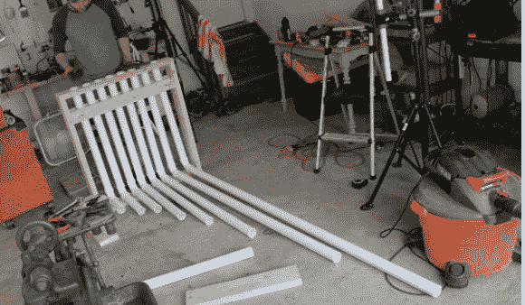

# PVC 打击管风琴听起来出奇的好！

> 原文：<https://hackaday.com/2014/05/25/pvc-percussion-pipe-organ-sounds-surprisingly-good/>

使用超过 20 英尺的 PVC 管，一大堆 2 x 4 和一些螺母和螺栓，[杰里米]和他的表弟组装了一个相当独特的打击管风琴。

[杰克逊]，他的表弟是一名音乐家，总是在寻找不同的方法来制作音乐。他们对自己想要用几张草图做什么有一个粗略的想法，但经过一天的修补，他们最终得到了完全不同的东西——但听起来很棒。

框架由 2 x 6 英寸和 2 x 4 英寸组合而成，用于固定 PVC 管。聚氯乙烯弯管和不同长度的管道创造了广泛的相当深的低音音符。它可以只用手来玩，甚至一双凉鞋效果更好。你会惊讶它听起来有多好。

[https://www.youtube.com/embed/oE-0TfaxCoI?version=3&rel=1&showsearch=0&showinfo=1&iv_load_policy=1&fs=1&hl=en-US&autohide=2&wmode=transparent](https://www.youtube.com/embed/oE-0TfaxCoI?version=3&rel=1&showsearch=0&showinfo=1&iv_load_policy=1&fs=1&hl=en-US&autohide=2&wmode=transparent)

[https://www.youtube.com/embed/lxbcx90khKQ?version=3&rel=1&showsearch=0&showinfo=1&iv_load_policy=1&fs=1&hl=en-US&autohide=2&wmode=transparent](https://www.youtube.com/embed/lxbcx90khKQ?version=3&rel=1&showsearch=0&showinfo=1&iv_load_policy=1&fs=1&hl=en-US&autohide=2&wmode=transparent)

聚氯乙烯的其他非故意用途… [儿童过山车怎么样？](http://hackaday.com/2012/08/11/manpowered-pvc-rollercoaster/)