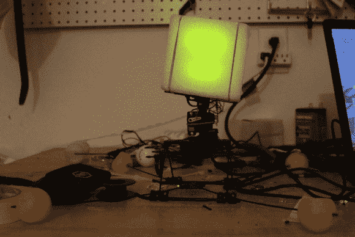

# PyMCU 测试项目看起来像《我的世界》暴徒

> 原文：<https://hackaday.com/2012/12/20/pymcu-test-project-looks-like-a-minecraft-mob/>



Hackaday 自己的[Jeremy Cook]一直在测试 pyMCU 板，并设法组装了一个动画头像，看起来可能是《我的世界》的敌人。这主要归功于他用作扩散器的泡沫块。该项目的外观是一组发光二极管。这些以及移动颈部的伺服电机都是用 Python 代码控制的，休息后你可以浏览一下(那里也有视频演示)。

我们第一次看到 pyMCU 是在今年年初。PIC 16F1939 提供了大量的 IO，并作为硬件和 Python 脚本之间的 USB 连接桥。说到硬件，测试平台以前是遥控直升机。[杰里米]报废了大部分，但保持伺服电机负责转子的间距。该板使这些连接变得容易，并且该概念使控制它们变得更加容易。事实上，控制伺服系统的功能只有大约 17 行代码。剩下的就是用 Tkinter 搭建的简单 UI。

 [https://www.youtube.com/embed/a524jLYFdGY?version=3&rel=1&showsearch=0&showinfo=1&iv_load_policy=1&fs=1&hl=en-US&autohide=2&wmode=transparent](https://www.youtube.com/embed/a524jLYFdGY?version=3&rel=1&showsearch=0&showinfo=1&iv_load_policy=1&fs=1&hl=en-US&autohide=2&wmode=transparent)

```

# File: hello2.py

from Tkinter import *
import pymcu    # Import pyMCU module

mb = pymcu.mcuModule()  # Create a new pyMCU class object from first found pyMCU board

class App:

    def __init__(self, master):

        frame = Frame(master)
        frame.pack()

        self.button = Button(frame, text=&quot;QUIT&quot;, fg=&quot;red&quot;, command=frame.quit)
        self.button.pack(side=LEFT)

        self.servos_up = Button(frame, text=&quot;nod up&quot;, command=self.nod_up)
        self.servos_up.pack(side=LEFT)

        self.servos_down = Button(frame, text=&quot;nod down&quot;, command=self.nod_down)
        self.servos_down.pack(side=LEFT)

        self.tilt_left = Button(frame, text=&quot;tilt left&quot;, command=self.tilt_left)
        self.tilt_left.pack(side=LEFT)

        self.tilt_right = Button(frame, text=&quot;tilt right&quot;, command=self.tilt_right)
        self.tilt_right.pack(side=LEFT)

    def nod_up(self):
        print &quot;nod up&quot;
        mb.pinHigh(1)
        mb.pausems(20)
        mb.pulseOut(11,1300,20)
        mb.pinHigh(2)

    def nod_down(self):
        print &quot;nod down&quot;
        mb.pulseOut(11,800,20)
        mb.pinLow(1)
        mb.pinLow(2)

    def tilt_left(self):
        print &quot;tilt left&quot;
        mb.pulseOut(10,1000,20)

    def tilt_right(self):
        print &quot;tilt right&quot;
        mb.pulseOut(10,1600,20)

root = Tk()

app = App(root)

root.mainloop()

```