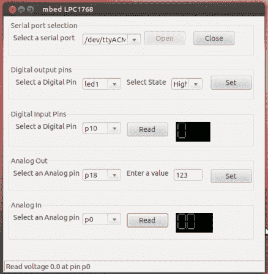

# Python 前端是用于不同微控制器的 GUI

> 原文：<https://hackaday.com/2013/02/26/python-frontend-is-a-gui-for-different-microcontrollers/>

[Navin]一直在努力开发一个能与不同微控制器配合使用的 GUI。这个想法是通过简化从原型硬件获得的反馈和控制，使开发项目变得更加容易。最棒的是，他设计的软件可以和任何可以用 C++编程的硬件接口。

上面的屏幕截图显示了程序与具有 ARM 微控制器的 mbed 板通信。但是也支持 Arduino 板(使用 ATmega 芯片)。通过为芯片编写自己的配置文件，可以增加对其他架构的支持。Python 程序随后会询问它应该在这个会话中使用的 com 端口。

源代码包，包括在微控制器上运行的代码，可以在项目库的[中找到。草图中使用的函数非常简单，应该很容易放入您自己的代码项目中。](https://github.com/navin-bhaskar/Controller)