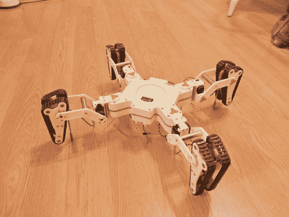

# 四足动物用四条腿行走，用四个踏板滚动

> 原文：<https://hackaday.com/2013/05/04/quadruped-walks-of-four-legs-rolls-on-four-treads/>

这个机器人不知道是步行机还是坦克。这是马克·哈门德的创意，他白天是机械工程师，晚上是疯狂的机器人专家。了解全部细节的最佳途径是深入研究[他在](http://www.lynxmotion.net/viewtopic.php?f=8&t=7256)上发布的长达六周的帖子。这将让你对他的方法有一个很好的了解，从项目的 SolidWorks 渲染开始，并在他将项目组合在一起时添加组装的组件。

每只脚的机械装置都很迷人。他磨出了白色的碎片，这些碎片堆积在一起，封装了驱动踏板的马达。这些组件枢转以使用作步行脚的金属杆与地面接触。但它们也使得调整轮胎面以应对崎岖地形成为可能。推进器芯片驱动该设备，Xbee 模块与控制器通信。

休息之后不要错过视频。转弯时你会听到一些打滑的声音，但[Marc]计划添加代码来调整电机速度，以补偿内外差问题。他还在 Flickr 上发布了一个相册。

[https://www.youtube.com/embed/UfrLRk6quMY?version=3&rel=1&showsearch=0&showinfo=1&iv_load_policy=1&fs=1&hl=en-US&autohide=2&wmode=transparent](https://www.youtube.com/embed/UfrLRk6quMY?version=3&rel=1&showsearch=0&showinfo=1&iv_load_policy=1&fs=1&hl=en-US&autohide=2&wmode=transparent)