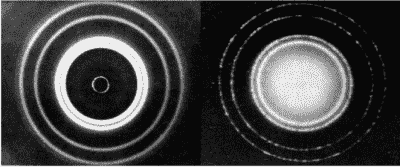
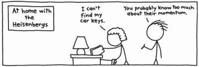

# 处理器中的量子力学:互补性

> 原文：<https://hackaday.com/2015/07/24/quantum-mechanics-in-your-processor-complementarity/>

【1927 年 10 月 24 日星期一|布鲁塞尔

虽然第五届索尔维会议的官方名称是“关于电子和光子”，但来宾们非常清楚，演讲将围绕量子力学的新理论。[普朗克]、[爱因斯坦]、[玻尔]、[德布罗意]、[薛定谔]、[海森堡]和当时的许多其他巨人都会出席。就在一个月前，[尼尔斯·玻尔]向 T2 卡杜奇研究所的物理学家同事透露了他的互补想法，该研究所位于意大利科莫湖岸边。

该理论表明，亚原子粒子和[波](https://en.wikipedia.org/wiki/Wave)实际上是一个“量子”硬币的两面。无论它呈现何种性质，是波还是粒子，都取决于好奇的科学家在寻找什么。不去寻找那个“波/粒子”物体却去问它是什么是没有意义的。不出所料，该理论受到了与会者的褒贬不一，但大多数人都被不在场的大人物(阿尔伯特·爱因斯坦)分散了注意力。他因病不能出席，但所有人都渴望听到他对[玻尔的]有点激进的理论的看法。毕竟，是他在 1905 年关于光电效应的论文中介绍了光的粒子性质，揭示了光可以被认为是称为光子的粒子。[玻尔的]理论调和了[爱因斯坦的]光电效应理论和对光的波动性质的经典理解。人们会认为他会为此而激动不已。然而，[爱因斯坦]却不认同[玻尔]的理论，他将用余生来试图证明它是错误的。

## 互补性——波、粒子还是两者都有？


【尼尔斯·玻尔】思考着【爱因斯坦】对量子理论的诸多挑战之一。

一个多世纪以来，人们一直认为光是一种波。1801 年，[托马斯·杨]发现了光线穿过两条非常近的狭缝时的干涉图样。干涉是波的一个众所周知的特性。这与预测电磁辐射存在的[麦克斯韦]方程相结合，使任何人都毫不怀疑光只不过是一种波。然而，有一个非常奇怪的问题在 18 世纪困扰着物理学家。当光照在金属表面时，电子会从该表面射出。增加光的强度并没有像经典力学所说的那样，转化为被驱逐电子速度的增加。增加光的频率*就增加了速度*。直到 1900 年，当[马克斯·普朗克]意识到物理[作用](https://en.wikipedia.org/wiki/Action_%28physics%29)不可能是连续的，而必须是某个小数量的倍数时，才有了对这一现象的解释。这个量将导致“作用量子”，也就是现在被称为“普朗克常数”的“T9”，并诞生了量子物理学。他不可能知道这个简单的想法，在不到二十年的时间里，会导致对现实本质理解的改变。然而，爱因斯坦只用了几年时间就用[普朗克的]作用量解释了这个令人难以置信的问题，即电子通过光从金属中释放出来，并且不遵循经典定律和难以置信的复杂方程:

```
E = hv
```

其中 E 是光量子的能量，h 是普朗克常数，v 是光的频率。这里要考虑的最重要的项目是这个光量子，后来被称为光子。它被视为一个粒子。现在，如果你现在没有困惑地抓头，你就没有注意。光怎么可能是波*而*是粒子？跳完之后加入我，我们将在这个物理兔子洞里继续旅行。

## 量子硬币的另一面

当光的波粒二象性正忙于迷惑世界上最聪明的物理学家普林斯[路易斯·德



(Left) X-ray diffraction in aluminum foil. (Right) Electron diffraction in aluminum foil.

法国的布罗意有一个奇怪的想法。如果电磁波可以有粒子性质，那么粒子是否可以有波动性质？1923 年，德布罗意在他的博士论文中向学术界介绍了他的假设。1929 年，他被授予诺贝尔物理学奖，两年后，他的论文被英国物理学家汤普森证实。汤普森用 X 射线和电子，这两种波和粒子性质都很明显的实体，对着一张有一个很小很小的孔的铝箔发射。从这个小孔发出的 X 射线的结果显示了经典物理学预测的波会显示的东西——衍射图案。电子流显示了相同的衍射模式，证明了电子的波动性符合德布罗意的假设。一个粒子可以表现出类似波动的特性，这一事实对精确知道它在时空中的位置的能力提出了质疑。

## 决定论的终结



XKCD guest [illustration by Bill Amend](https://xkcd.com/824/)

那么，一个人如何去尝试定位一个电子呢？根据德布罗意的假设，粒子的尺寸越小，它就越像波。电子是如此之小，以至于说一个人在特定的时间点处于空间的特定点是不可能的。做这种类型的观察太浪了。有许多方法来说明这个想法，更好的说法是[【海森堡的】测不准原理](https://en.wikipedia.org/wiki/Uncertainty_principle)。我最喜欢的，也是我认为最简单的理解方式是数学上的。考虑以下超级先进的复杂量子物理方程:

```
xy = z
```

```
Let 'x' equal momentum
```

```
Let 'y' equal position
```

```
Let 'z' equal the constant of h/4pi. Where 'h' is [Planck's] constant.
```

应该很容易看出 x 和 y 是成反比的。一个上升，另一个下降。换句话说，当你增加一个粒子(x)的动量值时，这个粒子(y)的位置精度就会降低。反之亦然。这是[海森堡的]测不准原理的核心。你不可能同时知道一个粒子的位置和动量。一个越精确，另一个就越不精确。

## 哥本哈根诠释

尼尔斯·玻尔的互补理论和海森堡的测不准原理一起构成了量子力学的哥本哈根解释。这一理论虽然在一定程度上仍有争议，但却是迄今为止对现实本质最广泛持有的观点。用最简单的术语来说——不可能知道我们研究的对象是粒子还是波，就像不可能知道它的位置*和*动量一样。你可以知道一个，但不知道另一个。两者都不能同时被认识。我们的宇宙有一种固有的不确定性，一种固有的随机性。它根深蒂固地存在于我们的生活中，否认它是徒劳的。

现在我们的量子理论历史课已经结束了，我们可以开始有趣的部分了，将我们新发现的知识应用于黑客攻击！我们现在知道，在我们的微处理器中快速移动的电子具有类似波动的特性。这是什么意思？我们可以带着这个去哪里？这将是下周处理器中量子力学的主题。敬请期待！