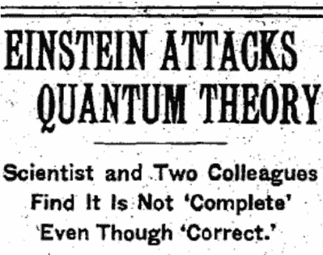
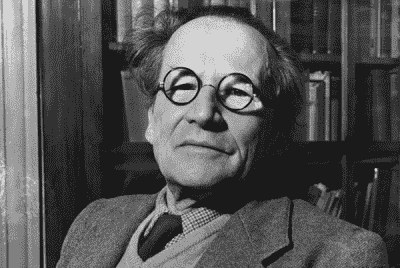
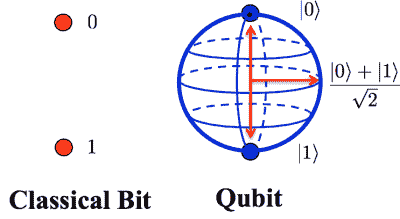

# 处理器中的量子力学:量子计算

> 原文：<https://hackaday.com/2015/08/06/quantum-mechanics-in-your-processor-quantum-computing/>

在[希特勒]控制德国后不久，他的政党通过了法律，禁止任何犹太人后裔在德国大学担任学术职务。这使得许多世界上最聪明的人离开了这个国家，包括阿尔伯特·爱因斯坦。爱因斯坦在普林斯顿的新家安顿下来，并开始寻找聪明的年轻数学家一起工作，因为他仍然对[尼尔斯·玻尔]和他的量子理论有意见。没过多久，他就遇到了一个美国人[纳森·罗森]和一个俄罗斯人[鲍里斯·波多尔斯基]。这三人组很快将向世界提出一个直接的挑战，这个挑战将打击量子理论对现实的定义的核心。与之前的挑战不同，这次挑战不会被[玻尔]轻易驳回。

需要补补课吗？你可以看看[互补](http://hackaday.com/2015/07/24/quantum-mechanics-in-your-processor-complementarity/)以及[隧道和晶体管](http://hackaday.com/2015/07/31/quantum-mechanics-in-your-processor-tunneling-and-transistors/)，但这只是让你了解量子计算的一些可选背景。

## EPR 论点

1935 年 5 月 4 日，《纽约时报》发表了一篇题为《爱因斯坦攻击量子论》的文章，对[爱因斯坦-波多尔斯基-罗森]的论文进行了非技术性的总结。我们应该做类似的事情。

在适当的条件下，伽马射线，这只是一种非常高频率的电磁波，可以变成一个电子-正电子对。正电子是电子的反粒子。它的质量和电子一样，但是

New York Times Headline

相反的电荷和自旋。如果两个粒子接触，它们会变回伽马射线。这是 E = mc 的基本演示。但是我们感兴趣的是电子-正电子对。因为它们是由同一个伽马射线形成的，所以这两个粒子被认为是纠缠在一起的。纠缠意味着一个改变会影响另一个。现在，根据量子理论，人们无法知道一个粒子的状态，直到它被观察到，观察的过程会破坏其他状态。例如，如果我们精确地观察我们电子的位置，我们就破坏了关于它动量的信息。电子的观测会对正电子产生什么影响？记住，两个粒子是纠缠在一起的。一方发生的事情会影响另一方。如果我观察到了电子的位置，那么正电子就不能再被认为处于未被观察到的状态。这个观察将导致波函数的坍缩。因为两个粒子纠缠在一起，所以它们共用同一个波函数。不要纠缠于细节 EPR 的论点可以总结如下:

通过测量电子的位置或动量，我们可以知道正电子拥有位置或动量。而我们不用直接观察正电子就能知道这一点。量子理论否认我们可以做到这一点。如果事情不能变得更奇怪，这将是真实的，不管粒子之间的距离。如果你制造一个纠缠的电子-正电子对，并把正电子送到最近的星系，它不会改变什么。当你观察电子时，两个粒子的波函数都坍缩了。立刻。爱因斯坦继续争辩说，他所说的这种“幽灵般的超距作用”与狭义相对论及其宇宙速度极限是不相容的。

[玻尔]对 EPR 论点的回应可以总结如下:

是啊，那又怎样？你无论如何都不能做这样的测量。所以不算。
* * *拂莓* * *

## 两个盒子，一个球和一只猫

[爱因斯坦]讨厌《纽约时报》的文章和它带来的所有关注。[玻尔的]反应是可预见的，并没有给悖论带来新的解释。他在自己和另一位量子物理哥本哈根解释的反对者、波动力学的发明者欧文·薛定谔(Erwin Schrodinger)之间的几封私人信件中表达了他的沮丧。在其中一封信中，他用一个简单的思维实验总结了他对该理论的感受:

Erwin Schrodinger 1887 – 1961.

假设你有两个盒子。每个盒子都有盖子。打开盖子往盒子里看被认为是一种观察。其中一个盒子里有一个球。球在第一个盒子里的概率是 50:50。问题是——这是完整的描述吗？我们能知道更多的信息吗？答案可能会让你大吃一惊。

a)不，这不是一个完整的描述。我们没有办法肯定地预测球在哪个盒子里，必须求助于概率。

b)是的，是完整的描述。球以预定的状态存在，不在任何一个盒子里。打开盖子会使球在其中一个盒子里具体化。多次尝试表明，我们有 50%的机会找到球。在打开盖子之前对盒子的描述仅仅是由概率决定的。没有理由进一步寻找描述。

爱因斯坦展示了(当时)宏观量子论观点的荒谬性。他不可能知道他刚刚在一个和他一样聪明的头脑中种下了一颗种子。一粒种子很快成长为人类历史上最大的悖论之一——(薛定谔的)猫。

## 量子计算

在 20 世纪 30 年代，只能谈论如果你做实验 A 和观察 b 会发生什么。随着时间的推移和技术的进步，有可能实际测试这些想法

实验，包括量子纠缠。到目前为止，证据表明【爱因斯坦】[是错的](http://www.cnet.com/news/researchers-demonstrate-quantum-entanglement-prove-einstein-wrong/)。看来两个盒子里的球的描述确实是完整的。虽然听起来很荒谬，但这是真的。在量子世界里，倒下的树不会发出任何声音。量子纠缠是一种数学上的，是实验证明的现实，纠缠的粒子在时空之外以某种方式联系在一起。问题是——我们能利用它吗？

还记得电子-正电子对吗？每一种都有一些相反的性质，包括自旋。让一个自旋等于“1”，另一个等于“0”。如果我们改变电子的自旋，正电子的自旋也会改变，*瞬间*。我们可以带着这个去哪里？

当一个粒子(或波)处于不可观测的状态时，我们说它处于叠加态。这意味着它具有波和粒子的特性。观察的行为将会决定它将会以何种方式显现。设波等于 1，粒子等于 0。在叠加态，它既是 1 又是 0。他们称之为量子位。

## 收场白

需要注意的是，[薛定谔的]猫仍然是一个未解的悖论。虽然当前的量子理论和它的量子力学在受到实验的挑战时继续保持稳定，但它存在一些严重的哲学问题。

事情是这样的。一只猫被放在一个盒子里，盒子里有盖革计数器、放射性物质、一罐毒药和一个 Arduino。放射性物质的半衰期是已知的，因此有 50%的可能性一个原子会在一个小时内分裂。如果一个原子解体，盖革计数器将告诉阿杜伊诺打破毒药罐，杀死猫。如果没有原子解体，猫就活了下来。

量子理论说，原子分裂或不分裂的行为只有在观察后才能知道。所以猫同时是活的和死的，最终结果只有通过看盒子来决定。观察的行为使波函数坍缩，原子被迫进入解体或非解体状态。

薛定谔对这个非常残酷的悖论所做的是把量子世界和它的定律带入宏观世界。它强调了一个事实，即作为量子理论基础的“波函数的坍缩”是一个公设。谁能说波函数何时坍缩？为什么不能是测量仪测辐射？为什么一定要由一个有意识的观察者来做？如果确实是观察者，那么可以认为有人在观察观察者；会看到观察者有 50%的机会找到一只死猫，另一半的机会找到一只活猫。谁在观察那个观察者？上帝？或者，会不会有两种现实……两个宇宙——一个是猫生活的地方，一个是猫死去的地方？

关于量子理论还有很多要说的。没有人知道量子理论结束和经典力学开始的边界。这对于预测实验结果确实非常有用。但这是对现实的真实描述吗？[加来道雄]对此有一些发人深省的话，可以在下面的 2.5 分钟视频中听到。

[https://www.youtube.com/embed/Sh5GCwt9PDs?version=3&rel=1&showsearch=0&showinfo=1&iv_load_policy=1&fs=1&hl=en-US&autohide=2&wmode=transparent](https://www.youtube.com/embed/Sh5GCwt9PDs?version=3&rel=1&showsearch=0&showinfo=1&iv_load_policy=1&fs=1&hl=en-US&autohide=2&wmode=transparent)

### *处理器中的量子力学*系列文章:

*   [互补性](http://hackaday.com/2015/07/24/quantum-mechanics-in-your-processor-complementarity/)
*   [隧道和晶体管](http://hackaday.com/2015/07/31/quantum-mechanics-in-your-processor-tunneling-and-transistors/)
*   量子计算

### **来源:**

吉姆·巴戈特的《量子故事》。第 16 和 17 章 ISBN- 978-0199566846