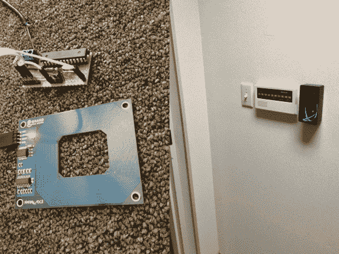

# 快速和肮脏的 RFID 门锁清理漂亮

> 原文：<https://hackaday.com/2014/07/18/quick-and-dirty-rfid-door-locks-clean-up-nice/>

[Shawn]最近彻底检查了他的门禁系统，在门上安装了一些 RFID 阅读器。尽管大楼里已经安装了电子开关，但开门需要敲击一个老化的键盘，或者缠着隔壁办公室的人按下按钮为你开门。[Shawn]通过将一些电线连接到阁楼上并连接到两个控制箱中的一个来接入该系统，每个控制箱内都有一个 ATMega328。一切都如你所料:将正确的 RFID 卡呈现给壁挂式读卡器，向微控制器发送信号，微控制器点击驱动锁的伴随继电器。

你可能还记得上个月发生的【Shawn 的】 [RFID 电话标签黑客事件；读者的加入是这个项目的第二步。如果你想重建这个版本，你应该不会有任何问题找到相同的视差阅读器或者在一根棍子上](http://hackaday.com/2014/06/15/simple-hack-puts-an-rfid-tag-inside-your-mobile-phone/)建造[你自己的 Arduino。跳伞后，请观看快速演练视频。](http://hackaday.com/2013/07/10/build-a-bare-bones-arduino-clone-which-maximizes-its-use-of-real-estate/)

[https://www.youtube.com/embed/sL7oQIm9qTY?version=3&rel=1&showsearch=0&showinfo=1&iv_load_policy=1&fs=1&hl=en-US&autohide=2&wmode=transparent](https://www.youtube.com/embed/sL7oQIm9qTY?version=3&rel=1&showsearch=0&showinfo=1&iv_load_policy=1&fs=1&hl=en-US&autohide=2&wmode=transparent)