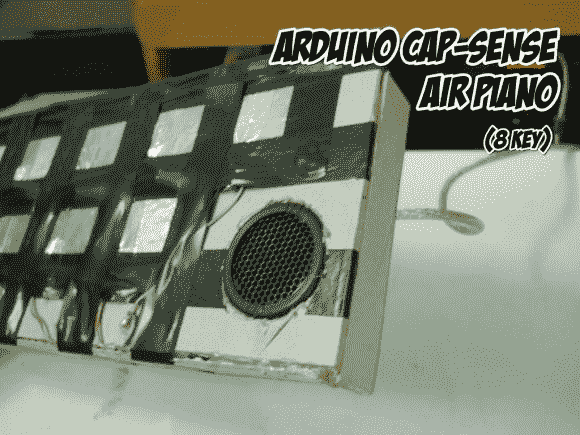

# 快速和肮脏的触摸感应键盘项目

> 原文：<https://hackaday.com/2013/06/03/quick-and-dirty-touch-sensitive-keyboard-project/>

你不一定要有高质量的零件才能摆弄电子产品，这里有一个很好的例子。[Vishal]使用垃圾来玩触摸感应 Arduino 库 CapSense。他最后得到的是[这个触摸式钢琴键盘](http://www.instructables.com/id/Arduino-Cap-Sense-Air-Piano/)。

过去我们已经使用过 CapSense 库,但即使是这个例子也使用了非常精心制作的测试装置，包括箔带、原型板和一些电阻。如果你还没有尝试过，就按照这个例子，使用铝箔、绝缘胶带和纸板盒。

[Vishal]只是将跳线的一端夹在两片箔片之间，以制作每个“钥匙”。我们认为，线的另一端焊接到偏置电阻，在那里它们连接到一对引脚接头。头部通过盒子底部的孔被热粘在适当的位置，使整个钻机简单地插入驱动它的 Arduino 板。在加上一个小扬声器和闪烁的代码后，他完成了。这当然是一个下午的短项目，你不会为以后拆开它而感到难过，因为你没有在构建中投入大量的时间或资源。