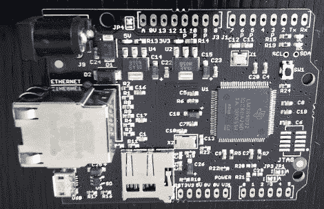

# 快速查看焊核开发板

> 原文：<https://hackaday.com/2012/06/27/quick-look-at-the-soldercore-dev-board/>

似乎黑客友好的 ARM 开发板现在正在市场上爆发。这里有一个我们还没看过的。[焊芯](http://soldercore.com/)由 Rowley Associates 制造，其功能丰富，有助于解释 80 美元的价格标签。[CharlieX]刚刚订购了一台，并在[上发布了一些他第一天使用该设备](http://charliex2.wordpress.com/2012/06/21/soldercore/)的情况。

首先，这显然是 Arduino 的外形。我们认为这是开发板中的一个很好的接触，但我们仍然希望 Arduino 的人没有抵消一个标题的方式。中间的那个芯片有相当大的冲击力。一款 80 MHz ARM Cortex-M3(TI)处理器，配有 512 kb 闪存和 96 kb RAM。内置的以太网插孔很难被忽略，但在这张照片的正下方，你也可以看到 USB On-the-Go 连接器。有一个 microSD 卡插槽和 3V 和 5V 稳压器。[CharlieX]对所提供的网络功能进行了一些黑客攻击，然后查看了固件升级。为此，你需要一张格式化为 FAT 16 的 SD 卡。