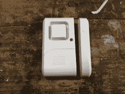
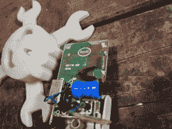
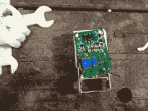
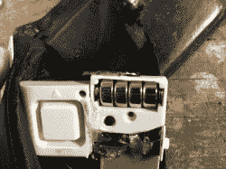
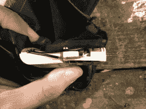
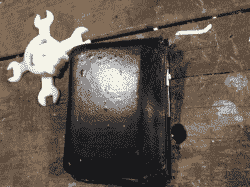
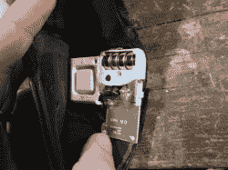
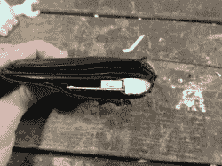

# 快速钱包黑客添加扒手报警

> 原文：<https://hackaday.com/2013/03/08/quick-wallet-hack-adds-pickpocket-alarm/>

[https://www.youtube.com/embed/qO8eFhkKJy0?version=3&rel=1&showsearch=0&showinfo=1&iv_load_policy=1&fs=1&hl=en-US&autohide=2&wmode=transparent](https://www.youtube.com/embed/qO8eFhkKJy0?version=3&rel=1&showsearch=0&showinfo=1&iv_load_policy=1&fs=1&hl=en-US&autohide=2&wmode=transparent)

最近网上流传着一堆关于世界上最厉害的扒手的视频。简单地说，如果他们想要你有的东西，他们会拿走，而你可能不会注意到。我总是把我的钱包放在前面的口袋里，通常我的手放在上面，但他们甚至在视频中展示了他们如何绕过它(你不能总是保持警惕)。

我想制造某种警报，如果除了我之外的任何人从我的口袋里拿走钱包，它就会响起来。快速的谷歌搜索发现了大量的钱包警报，但我注意到它们都有一个信用卡外形(这很好)，当暴露在光线下时会发出噪音(这很糟糕)。这代表了一个问题，因为视频中的扒手往往不会打开钱包，直到后来在另一个地方。我需要一个从口袋里拿出来时会发出声音的东西。最重要的是，我需要闹钟放在钱包里。这立即使钱包不受欢迎，并希望有人像热煤一样扔掉它。

我碰巧有几个小小的磁性窗户报警器。它们只是一个带有磁簧开关的大声蜂鸣器。在我可怜的又胖又旧又被忽视的钱包上举起一个后，我发现这个闹钟的厚度和我应该从钱包里清理出来的所有旧名片的厚度差不多。

我立即把闹钟拆开，开始计划如何尽可能地把它瘦身。大部分厚度来自外壳，电池将是下一个最大的贡献者。在试图将蜂鸣器从塑料外壳中撬出来，破坏了蜂鸣器之后，我决定离开蜂鸣器，简单地与厚度一起生活。毕竟，如果原型工作得很好，我以后可以用信用卡的形式设计一些东西。也就是说，如果我的注意力持续时间足够长，可以做这样的事情。

我对警报本身唯一真正的修改是取消了簧片开关的焊接，并把它放在了整个混乱的最末端。这将允许它位于钱包的“脊柱”处，并使电源开关保持在开口处以便于接近。剩下的就是尽可能地切掉大部分，然后热粘合在一起。

它实际上和预期的完全一样。警报有两种选择，一种是移除时发出一声蜂鸣声，另一种是持续警报。我建议的唯一大的升级是一个更强的磁铁，所以它不需要完全对齐。