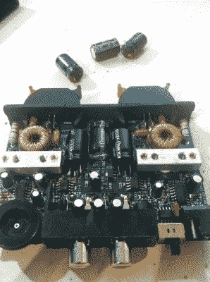

# [Quinn]复活一个经历过电容死亡的放大器

> 原文：<https://hackaday.com/2012/09/12/quinn-resurrects-an-amplifier-that-experienced-death-by-capacitor/>

[Quinn Dunki]正在她家的所有房间里安装无线音频。她会选择 Airplay，购买二手或翻新的 Airport Express 设备，因为它们能够与她现有的 WiFi 和 Airplay 协议配合使用。拼图的最后一块是得到一个放大器，她选择了上面看到的小单位。问题是，它在到达时就已经死了，她无法让公司对她的问题做出回应。所以她把它砸开，然后马上修好。

罪魁祸首就是图中上方的三个电解电容。她为每张照片都拍了一些特写，你不会错过它们被吹灭的事实。这些往往是单价较高的零件，制造商试图尽可能节省成本。再加上像这样的小封闭空间里的热量，你就失败了。[Quinn]翻遍了她的垃圾箱，但替换的大小必须完全匹配，所以她最后下了零件订单。休息后，你可以在剪辑中听到新的帽子非常适合和工作。

[https://www.youtube.com/embed/iVJNEpCGZ88?version=3&rel=1&showsearch=0&showinfo=1&iv_load_policy=1&fs=1&hl=en-US&autohide=2&wmode=transparent](https://www.youtube.com/embed/iVJNEpCGZ88?version=3&rel=1&showsearch=0&showinfo=1&iv_load_policy=1&fs=1&hl=en-US&autohide=2&wmode=transparent)