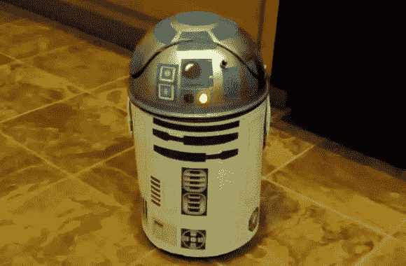
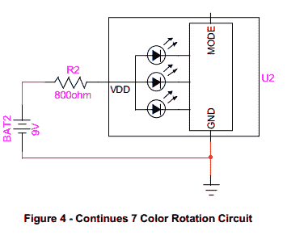

# R2D2 像老板一样收集情人节卡片

> 原文：<https://hackaday.com/2013/02/16/r2d2-collects-valentines-cards-like-a-boss/>

回想一下你的学生时代，那时每个学生都会做一个盒子来装他们朋友送的情人节卡片。我们有购买印有忍者神龟的卡片的美好回忆。我们猜想这一传统仍在继续。Franken Storer 博士没有用鞋盒做插座，而是帮助他七岁的孩子制作了这个带声音和灯光的遥控 R2D2。是啊，完全是作弊。但是谁能嫉妒一个黑客爸爸有点乐趣呢？

这个机器人最初是一个桌面垃圾桶。它有一个圆顶，看起来就像机器人，但也有一个可以放卡片的铰链开口。他在盖子上安装了一个倾斜开关，可以触发收音机的声音播放器来播放声音。这些声音模块在很多项目中很受欢迎，比如这个门铃黑客项目。最后一点(除了外部的机器人装饰)是增加一辆遥控汽车，让他的儿子开着 R2 到处跑。

我们要求更多的细节，他提供了。你会在跳转之后找到他对该项目的冗长描述。

[https://www.youtube.com/embed/jMLkHwNXdQQ?version=3&rel=1&showsearch=0&showinfo=1&iv_load_policy=1&fs=1&hl=en-US&autohide=2&wmode=transparent](https://www.youtube.com/embed/jMLkHwNXdQQ?version=3&rel=1&showsearch=0&showinfo=1&iv_load_policy=1&fs=1&hl=en-US&autohide=2&wmode=transparent)

> 灵感——(邪恶博士的声音)当我上一年级时，像我们许多人一样，我们的任务是建造“最好的”情人节卡片盒子，然后看谁赢了。我把我的包好，用箔纸包起来，用粉色和紫色的心，把开口做成心形，我想我肯定会赢。然后一个叫阿什莉的妈妈的女孩拿着一个 4'x4 '的平台走进来。这是一座城堡，我拍的是 4-5 层楼高，看起来很详细的城堡。完成操作拉桥放入卡片。很明显我输了。那天我发誓，当我有自己的孩子时，我会帮助他们建立所有持卡人的持卡人，为我的损失报仇，我想我们在这里做到了。当然，我只是告诉我 7 岁的孩子，我认为这很酷，我会帮助他，但自私地说，我希望阿什利的孩子的爸爸远没有这么酷，他们正在处理一些锡纸鞋盒…(邪恶博士的声音现在关闭)
> 
> 我的儿子是一个狂热的《星球大战》迷，非常喜欢它，最近还迷上了乐高/和我一起玩。所以我想现在是做些有趣的事情的时候了。当 R2 从学校回家谈论如何制作他的情人节盒子时，我突然想到了用一个桌面大小的垃圾桶。从那时起，我想我应该添加灯光，然后我想到了声音，我 7 岁的儿子 Seth 建议我让它动起来。计划是让他开着它四处收集情人节礼物，当孩子们把它们加入时，倾斜开关会让 R2 发出电影声音。我们完成了所有的目标，而且只花了大半个星期六的时间！
> 
> 第一步——我们在亚马逊上购买了完美尺寸的易拉罐:
> 
> [链接已删除；搜索亚马逊的本影迷你回收]
> 
> 第二步——当我们等待它到来的时候，我在网上找到了一些日本人制作自己的纸 R2D2，遗憾的是 PDF 格式的链接不再可用，幸运的是我找到了其他人保存它的地方，并重新上传到互联网上。附上我们使用的 PDF 格式的 PNG。我基本上是把 R2D2 的“垃圾桶”部分拉伸到 3 张 8.5×11 的纸上。垃圾桶的罐子部分大约是完美的高度，我不得不从纸上剪掉几英寸以达到完美的吻合。
> 
> 第三步——我们用胶带将纸质设计贴合到易拉罐上——我们遇到的唯一问题是易拉罐底部比顶部稍微小了一点，考虑到我们的时间表，我无法将设计重新调整到合适的角度，使其看起来和贴合得恰到好处，所以我们做了一些修改，但看起来仍然很棒。我们用沃尔玛的 3M picture safe 喷雾粘合剂喷洒纸张和易拉罐，并小心翼翼地将其涂在易拉罐上。
> 
> 第四步——我们用沃尔玛的银色塑料喷漆喷涂罐子的顶部，然后尽我们所能打印一些随机形状的正方形和顶部的圆形设计(我承认我用了 MS Paint 做形状！！！)我们把它们剪下来，然后用喷胶粘上。
> 
> 步骤 5–无线电室零件清单:
> 
> 1.你需要一个录音/回放设备——http://www.radioshack.com/product/index.jsp?productId=2102855
> 
> 2.你需要一个 7 色 LED 灯—[http://www.radioshack.com/product/index.jsp?productId=3060680](http://www.radioshack.com/product/index.jsp?productId=3060680)
> 
> 3.800 欧姆电阻(或者尽可能接近他们的库存，我们购买了 470、200 和 120 欧姆电阻，并将它们连接在一起。
> 
> 4.9v 电池
> 
> 5.金属 LED 支架(看起来更酷，更容易安装到垃圾桶盖上)–[http://www.radioshack.com/product/index.jsp?productId=2062559](http://www.radioshack.com/product/index.jsp?productId=2062559)
> 
> 第 6 步-最后两个部分-我们在沃尔玛买了一辆 8 美元的遥控汽车，从百思买移动音频安装湾买了一个倾斜开关。
> 
> 1.[http://www . Amazon . com/Install-Mercury-Switch-Clear-IBMS-5/DP/b 0068 aezbg/ref = Sr _ 1 _ 3？ie = UTF8&qid = 1360869361&Sr = 8-3&关键词=倾斜+开关](http://www.amazon.com/Install-Mercury-Switch-Clear-IBMS-5/dp/B0068AEZBG/ref=sr_1_3?ie=UTF8&qid=1360869361&sr=8-3&keywords=tilt+switch)
> 
> 2.新的明亮 RC/卡车(当地沃尔玛 9 美元，radioshack 有一辆类似大小的卡车，但它是 13 美元，所以我们把它退回去了)
> 
> 第七步——看图。我从百思买(best buy)的倾斜开关上切下巨大的透明塑料外壳，用拉链将它穿过我在摇摆垃圾桶盖侧面钻的一个洞
> 
> 第 8 步-钻孔并将 LED 安装到罐的前面(使用没有 LED 的第二个 LED 支架模仿 R2 的样子，但是安装得太高)
> 
> 第九步——把互联网上的 R2D2 声音录制到 radioshack 设备上——我们在 Youtube 上发现了一些很棒的声音。
> 
> 第 10 步——因为要上一年级了，我切断了“录音”开关，以防在学校意外丢失 R2 声音，并切断了录音设备的麦克风。一旦我们有了声音，我们还移除了播放开关，并将导线焊接到倾斜开关以激活声音。
> 
> 步骤 11–拼接 9v 电池引线，并将其连接至 LED/电阻器，如图所示:
> 
> 
> 
> 第 12 步——我们拿了一张垃圾桶底部大小的纸，把遥控卡车举过它。我们在轮胎周围描摹，然后将图案转移到罐子底部，并用美工刀为驱动轮切出 4 个矩形孔(为前轮转弯留出额外空间)。我还刻了一个区域，让开关更容易够到，然后我们用拉链把卡车绑在罐子底部。为了完成它，我们切了一个纸板圈，把它放在卡车上，给罐子一个假底，防止卡片在行驶时被车轮卡住。
> 
> 第 13 步——挂上 9v，测试你的倾斜开关，去兜风吧！塞斯爱 R2，虽然他对我不能在电影的某个部分模仿让 R2 飞翔的火箭感到失望，但他仍然爱我，因为我们完成了什么。一旦我知道了，我会告诉你他是否会赢！
> 
> 第 14 步–可选–Seth 想要添加腿，所以在他徒手画完腿后，自己给它们上色，然后我们用纸板把它们剪下来并连接上，我不得不同意他，它们完成了外观！
> 
> 如果我们有更多的时间和更大的预算，在一张卡片被扔进去后让 R2 的头旋转会很酷，但是总有明年，我 2 岁的孩子要在未来度过！