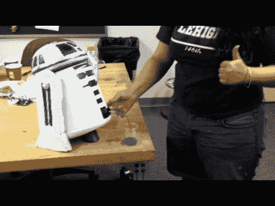

# R2D2 饮料自动售货机会很高兴地在你的杯子里叮当作响

> 原文：<https://hackaday.com/2012/08/16/r2d2-drink-dispenser-will-happily-tinkle-in-your-glass/>

就像赫特人贾巴一样，我们希望有自己的服务机器人来端上一份冷盘。我们很幸运；看起来你可以把[变成你自己的饮料分发机器人](http://www.instructables.com/id/R2D2-Beverage-Machine/)，如果你不介意一点点尴尬的分配。

人体最初是一个大的蛋白质饮料混合容器。在喷上白色并用蓝色油漆工的胶带遮住整个物体后，蓝色图案的形状被剪下并涂上颜色。业余爱好商店的半个泡沫球被用来形成穹顶。

液体由泵系统从一个超级透雨电动水枪中分配。你可以在休息后的视频中看到它用一种神秘的蓝色液体装满了一个烧杯。挑战 bar2d 2 T1 还有很长的路要走，但这也是一个普通人能做的事情

[https://www.youtube.com/embed/l8iNuIP6pT0?version=3&rel=1&showsearch=0&showinfo=1&iv_load_policy=1&fs=1&hl=en-US&autohide=2&wmode=transparent](https://www.youtube.com/embed/l8iNuIP6pT0?version=3&rel=1&showsearch=0&showinfo=1&iv_load_policy=1&fs=1&hl=en-US&autohide=2&wmode=transparent)