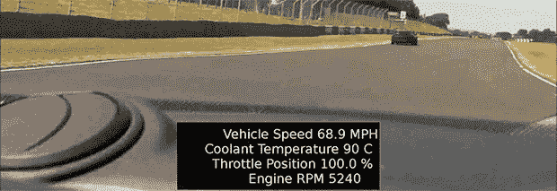

# 驾驶舱视角下的赛车遥测技术

> 原文：<https://hackaday.com/2013/07/30/racing-telemetry-on-a-cockpit-view/>

[马丁]有一个 Lotus Elise 和访问一个轨道。听起来很有趣，是吧？唯一的问题是他制作的 dashcam 视频有点无聊。当然，他们显示他在赛道上飞行，但是没有一些数据，真的很难提高他的驾驶技术。考虑了一会儿后，[马丁]决定他可以使用他的树莓 Pi 和相机模块从他的汽车的仪表板上录制视频，并将发动机数据如每分钟转数、油门和速度叠加在视频上。

捕捉视频是这个构建的简单部分——[ Martin]只需连接他的 Raspi 相机模块，并使用标准的 raspivid 捕捉实用程序。不过，将数据叠加到这个捕捉到的视频上有点困难。

[Martin]以前写过使用 Raspi 将 OBD-II 数据读入他的 Raspi。将这与 Python 脚本结合起来，为他的电影编写字幕，他就可以参加比赛了，赛道上的每个动作都有视频和数据回放。

生成的电影和字幕文件可以重新编码为高清电影。在 Raspi 上重新编码一个 13 分钟的高清视频需要 9 个小时。我们建议用一个更强大的 compy 来做这件事，但至少[Martin]有一个很好的解决方案来修复他稍微没有信息的音轨视频。