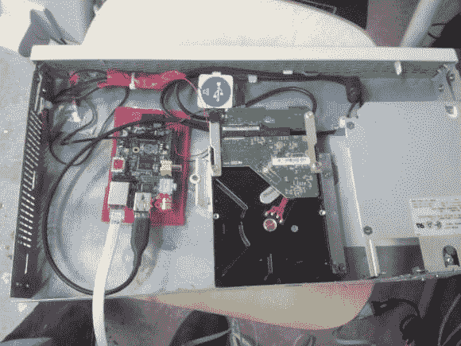

# Rackmount RasPi 不会为丢失数据留下任何借口

> 原文：<https://hackaday.com/2014/05/12/rackmount-raspi-leaves-no-excuse-to-lose-data/>

[Frank]知道备份对于数据安全的重要性，但他经常插入硬盘进行手动备份的旧方法并不是最可靠或最安全的数据备份方式。他意识到他需要一个安全的自动化解决方案。他不需要一台功能强大的全尺寸电脑；这么简单的东西为什么要浪费电？他的解决方案是使用一个树莓 Pi 作为备份计算机。

他在 Pi 上面临的主要问题是找到一种方法使它可以安装在机架上。从一个空的 1U 服务器开始。然后，他不得不弯曲一些金属板，以便将备份驱动器安全地安装到机箱中。几个小橡胶垫有助于抑制硬盘引起的任何振动。

计算机电源能够输出硬盘所需的 12V 电压，但不能输出运行 Pi 所需的 5V 电压。[Frank]的解决方案是使用基于 LM2596 的开关电源将 12V 转换为 5V。他将电源线直接焊接到 Pi 上，认为 USB 插头可能会随着时间的推移而松动。将圆周率仪安装到电脑机箱上应该是最棘手的部分，但是[Frank]通过简单地将圆周率仪的塑料外壳粘到电脑机箱的内部，使它变得很容易。总而言之，备份服务器在满负荷时消耗 29W，磁盘旋转时消耗 9W，空闲状态下大约只有 2W 消耗。

在软件方面，[Frank 的]备份箱使用 bash shell 脚本来完成工作。Pi 通过 VPN 连接到他的主服务器，然后 bash 脚本使用 rsync 实际收集文件。该系统不仅每晚保存备份，还保留了一周前的备份以防万一。如果你真的很担心你的备份，试着在你的 Pi 上安装一个[定制电池备份](http://hackaday.com/2013/11/17/battery-backup-for-raspi-keeps-your-data-safe/ "custom battery backup")解决方案。如果 Pi 不适合你，你可以尝试 T2 和其他方法中的一种。