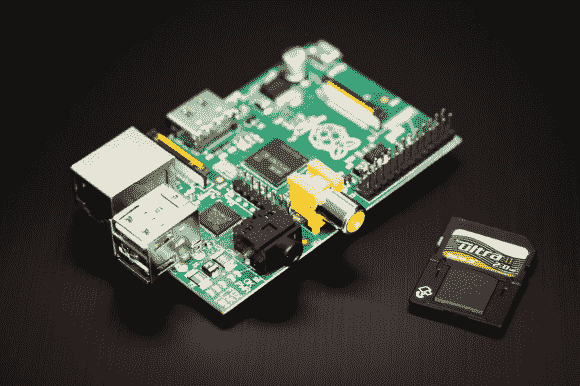

# 作为插件哈希采集器的 Raspberry Pi

> 原文：<https://hackaday.com/2013/02/14/raspberry-pi-as-a-plug-in-hash-harvester/>

插上电源和以太网，[这个 Raspberry Pi 板会自动从网络上的计算机收集 Windows 散列值](http://mad-sec.blogspot.com/2013/02/raspberrypi-wpad-autopwn.html)。有了几块 RPi 板，[Travis]正在寻找更多的黑客来尝试它们。这是一个很好的小测试，看看棋盘如何应对既定的进攻。

首先，他启动了标准的 Raspbian 发行版。在那里，他加载了 Metasploit 框架，该框架提供了大部分必要的工具。它使用 Web 代理自动发现协议( [WPAD](http://en.wikipedia.org/wiki/Web_Proxy_Autodiscovery_Protocol) )向任何监听网络的 Windows 机器请求散列。一些版本的操作系统用 LM 哈希来响应，其他的则没有。这一点的重要性和使用彩虹表破解哈希表的细节在[这篇关于这个主题的文章](http://www.packetstan.com/2011/03/nbns-spoofing-on-your-way-to-world.html)中有解释。

我们不介意有一个小的硬件黑客，在 GPIO 头上增加几个 led，这样你就知道 RPi 什么时候完成了数据收集。