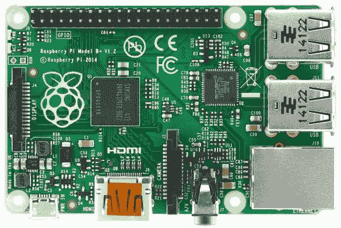

# Raspberry Pi 备份脚本

> 原文：<https://hackaday.com/2014/08/11/raspberry-pi-backup-scripts/>

[Matthew]最近的博客文章很好地解释了 Raspberry Pi 文件系统的基础知识。安装在 Pi 上的 Linux 操作系统通常安装在 SD 卡的两个不同分区上。第一个分区是一个小 FAT 分区。这个分区上的所有文件都用于 Pi 的初始引导。这个分区还包括内核映像。第二个分区是根文件系统，通常格式化为 ext4。这个分区包含操作系统的其余部分、用户文件、已安装的程序等。

记住这一点，您可以推断出，为了备份您的 Pi，您真正需要做的是备份所有这些文件。[Matt]已经编写了一些脚本来使它变得轻而易举。第一个脚本只是将所有文件复制到一个 gzipped 归档文件中。您可以将其保存到外部 SD 卡、USB 驱动器或网络共享。

第二个脚本可能更有趣。该脚本要求您有一个空闲的 USB 端口和一个 USB SD 读卡器。该脚本将自动格式化额外的 SD 卡，以包含两个关键分区。然后，它会将“引导”文件复制到新的引导分区，并将根文件系统文件复制到新 SD 卡的根分区。当一切都结束时，你将得到一个 SD 卡，它是你当前运行的文件系统的精确拷贝。

如果您有多个希望运行相同软件的 Pi，比如在一个 [Pi 集群](http://hackaday.com/2014/02/17/40-node-raspi-cluster/)中，这将非常方便。另一个很好的例子是，如果您花了很多时间调整您的 Pi 安装，并且您想为朋友制作一个副本。当然有很多方法可以剥这只猫的皮，但看到一个有创意的黑客定制的东西总是很有趣。